# ship-go Architecture Overview

This document provides a comprehensive overview of the ship-go library architecture, component relationships, and data flow patterns.

## Table of Contents
- [Overview](#overview)
- [System Architecture](#system-architecture)
- [Core Components](#core-components)
- [Connection Flows](#connection-flows)
- [State Machines](#state-machines)
- [Security Architecture](#security-architecture)
- [Threading and Concurrency](#threading-and-concurrency)
- [Error Handling](#error-handling)
- [Extension Points](#extension-points)

## Overview

ship-go is a Go implementation of the SHIP (Smart Home IP) protocol version 1.0.1, which is part of the EEBUS specification. It provides secure device discovery, pairing, and communication capabilities for smart home energy management systems.

## System Architecture

### High-Level Component Diagram

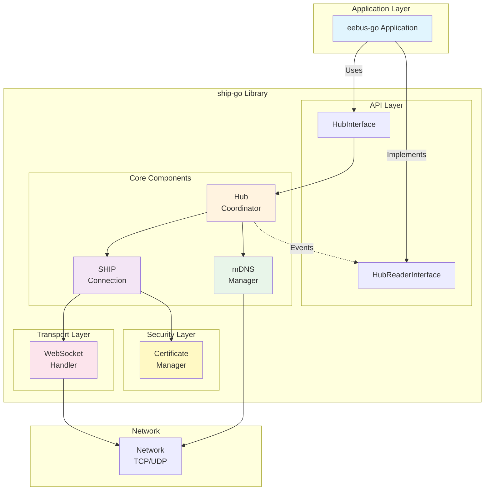

### Data Flow Architecture

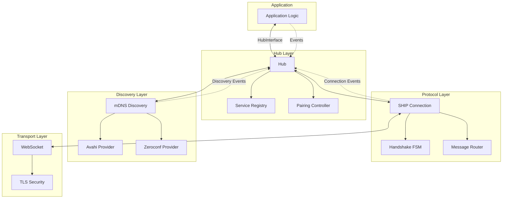

## Core Components

### 1. Hub (`hub/`)
The Hub is the central coordinator that orchestrates all SHIP/SPINE communication.

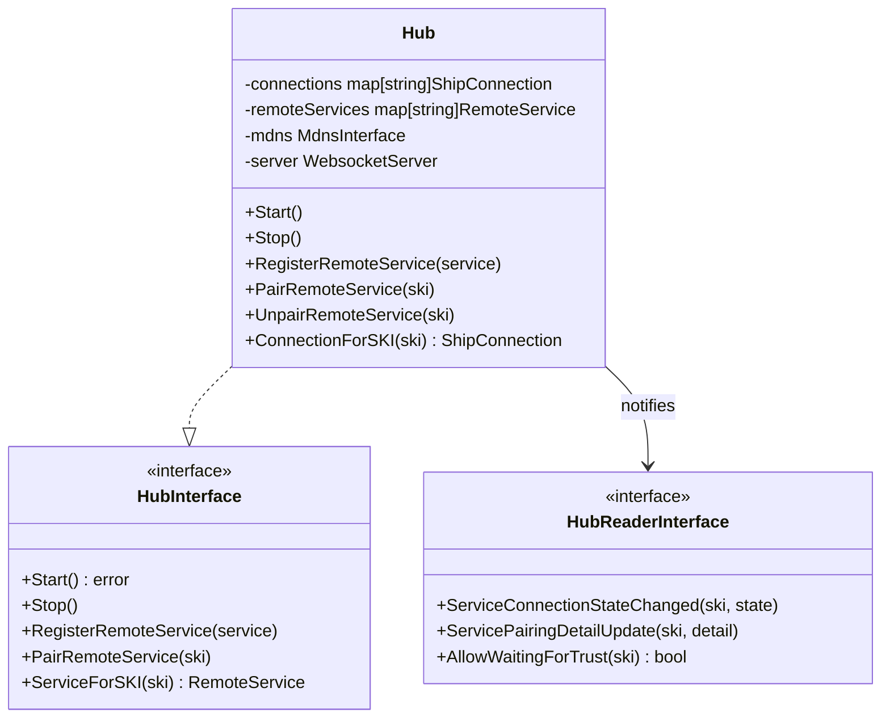

**Key Responsibilities:**
- Manages WebSocket server for incoming connections
- Coordinates mDNS discovery and announcements  
- Handles device pairing and connection state management
- Maintains registry of known remote services
- Prevents double connections using SKI comparison

### 2. SHIP Connection (`ship/`)
Implements the SHIP protocol handshake and message routing.

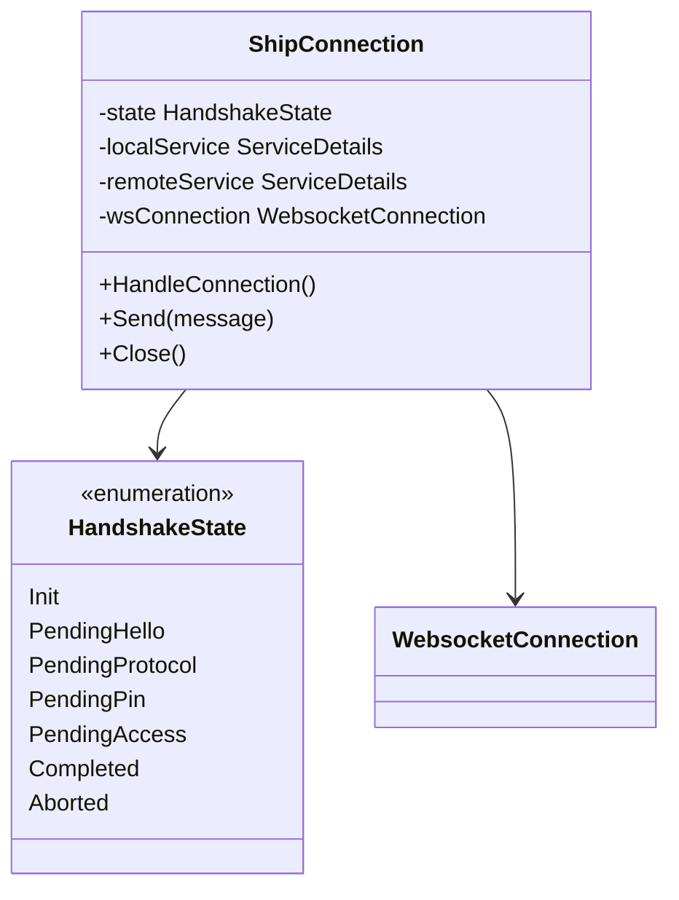

### 3. WebSocket Layer (`ws/`)
Provides reliable message transport over WebSocket connections.

**Features:**
- Automatic ping/pong for connection health monitoring
- Buffered write operations with thread safety
- Graceful connection closure handling
- Configurable timeouts and buffer sizes

### 4. mDNS Discovery (`mdns/`)
Handles service discovery and announcement using multicast DNS.

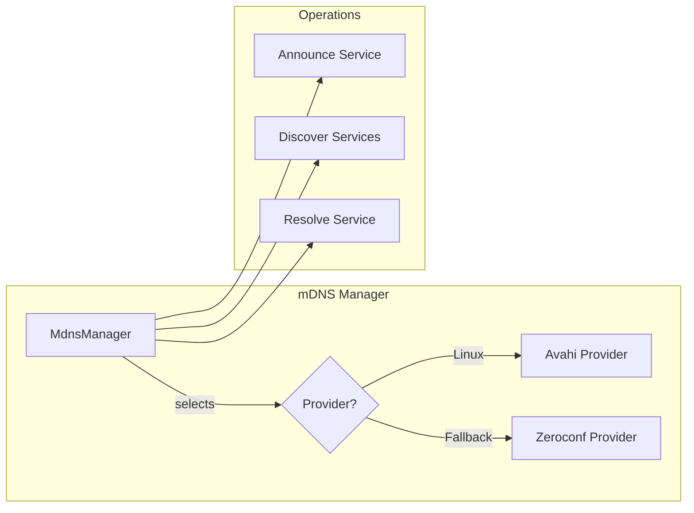

### 5. Certificate Management (`cert/`)
Handles X.509 certificate operations for device identification.

**Key Functions:**
- Generate self-signed certificates with EEBUS extensions
- Extract and normalize SKI (Subject Key Identifier)
- Configure TLS for secure connections
- Validate certificate chains

## Connection Flows

### Device Discovery and Connection Flow

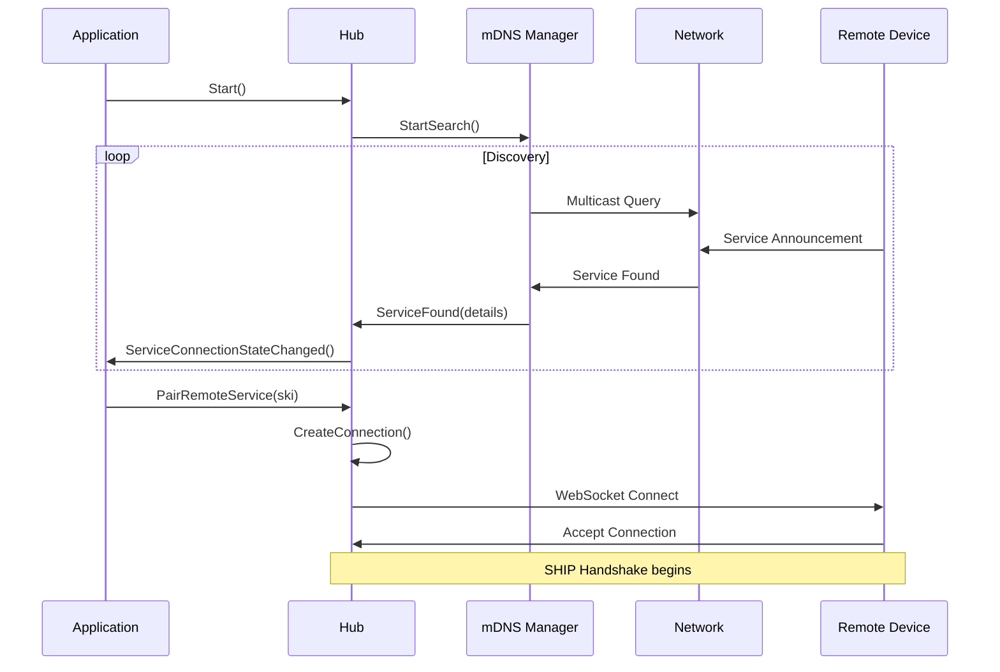

### SHIP Handshake Sequence

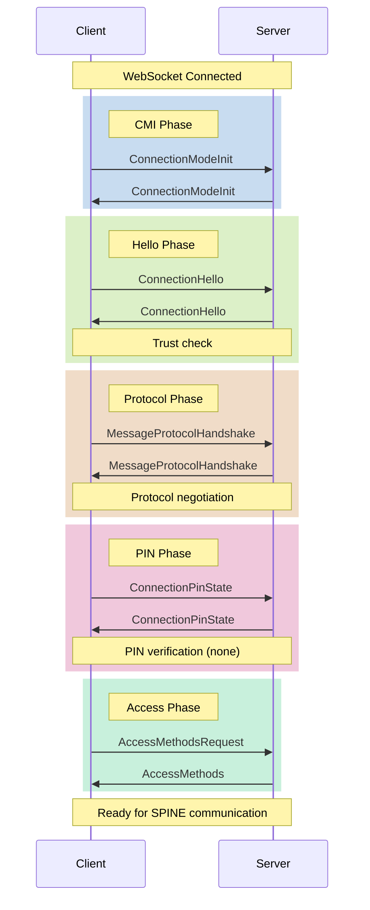

### Pairing Process Flow

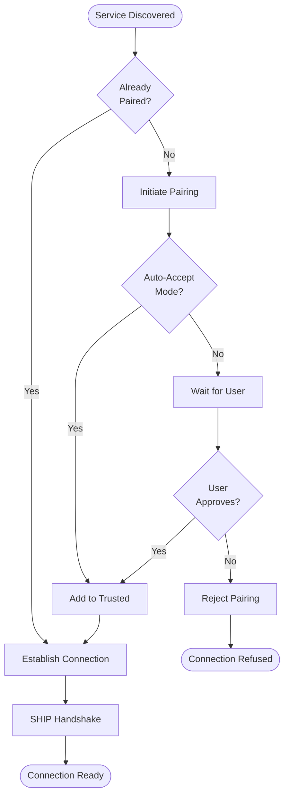

## State Machines

### Connection State Machine

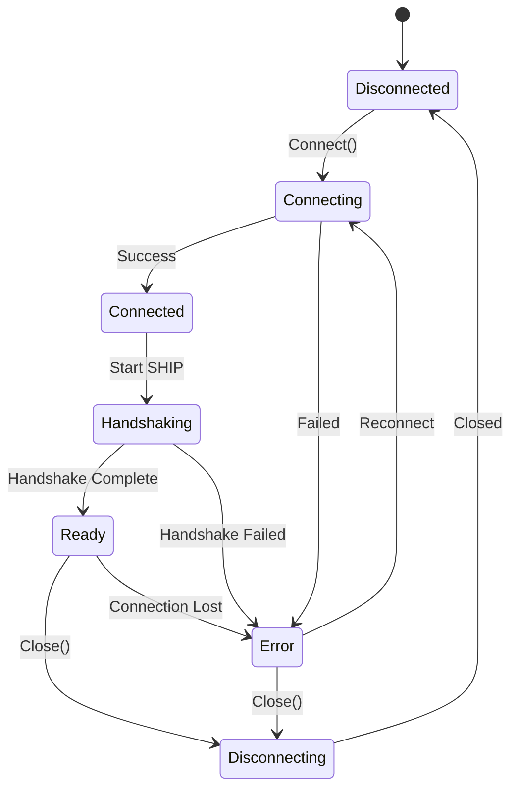

### SHIP Handshake State Machine

```mermaid
stateDiagram-v2
    [*] --> Init
    
    Init --> PendingHello: Send/Receive CMI
    PendingHello --> PendingProtocol: Hello Exchanged
    PendingProtocol --> PendingPin: Protocol Agreed
    PendingPin --> PendingAccess: PIN Verified
    PendingAccess --> Completed: Access Granted
    
    PendingHello --> Aborted: Trust Failed
    PendingProtocol --> Aborted: Protocol Mismatch
    PendingPin --> Aborted: PIN Failed
    PendingAccess --> Aborted: Access Denied
    
    Aborted --> [*]
    Completed --> [*]
```

## Security Architecture

### Trust Model

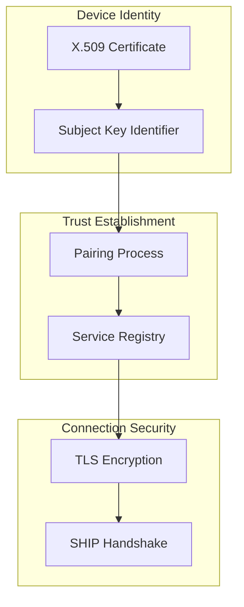

### Security Layers
1. **Transport Security**: TLS 1.2+ with mutual authentication
2. **Device Identity**: X.509 certificates with EEBUS extensions
3. **Trust Management**: Explicit pairing with persistent trust store
4. **Protocol Security**: SHIP handshake validates trust before data exchange

## Threading and Concurrency

### Goroutine Architecture

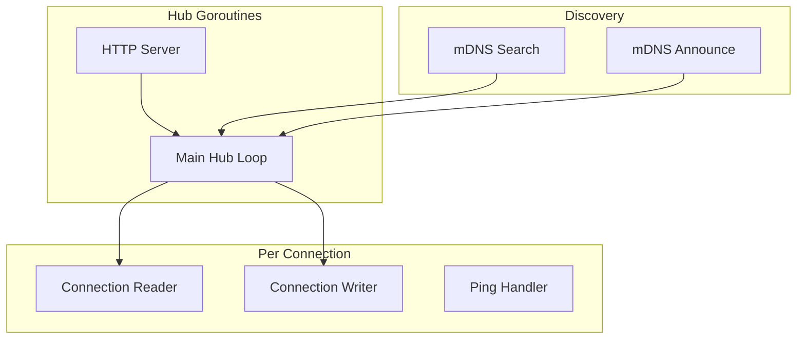

### Synchronization Strategy
- **Mutexes**: Protect shared state (connection maps, service registry)
- **Channels**: Coordinate goroutine lifecycle and event propagation
- **Atomic Operations**: For connection state and counters
- **Context**: Graceful cancellation of operations

## Error Handling

### Error Propagation Flow

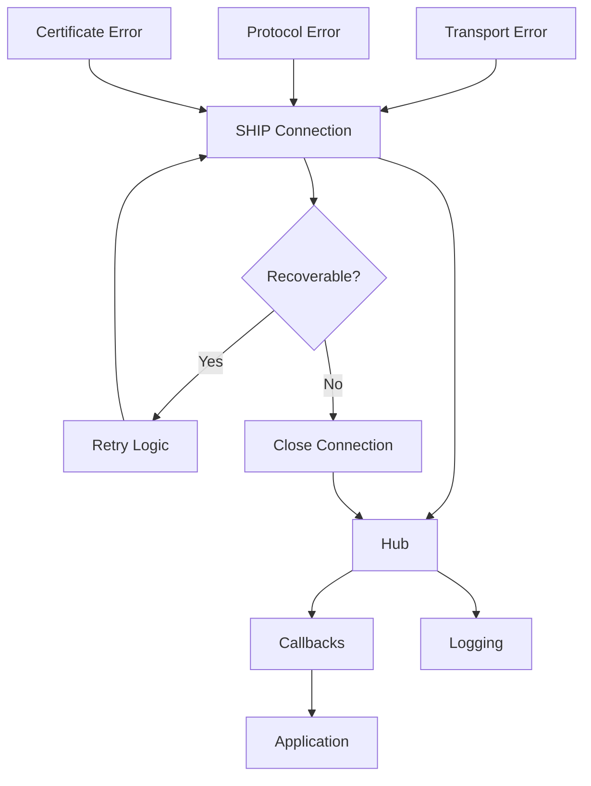

### Error Categories
1. **Transport Errors**: Connection loss, timeouts
2. **Protocol Errors**: Invalid messages, state violations
3. **Security Errors**: Certificate validation, trust failures
4. **Discovery Errors**: mDNS failures, network issues

## Extension Points

### Interface Implementation Guide

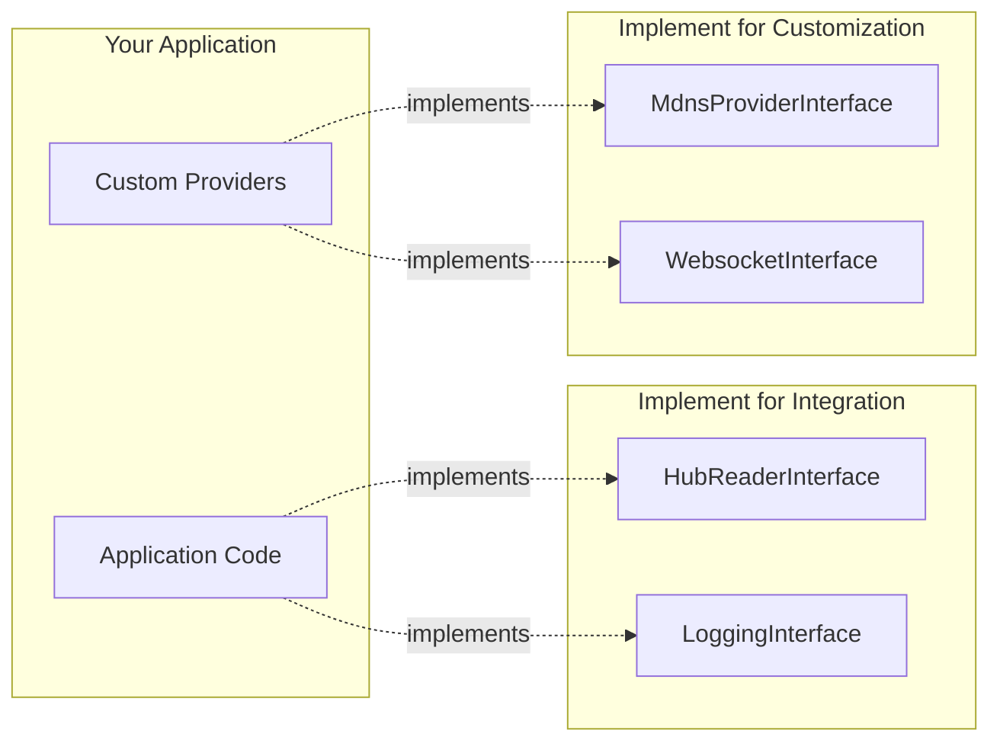

### Extension Examples
1. **Custom mDNS Provider**: Implement `MdnsProviderInterface` for platform-specific discovery
2. **Alternative Transport**: Implement `WebsocketDataWriterInterface` for non-WebSocket transport
3. **Custom Logging**: Implement `LoggingInterface` for application-specific logging
4. **Authentication Extensions**: Extend handshake for custom authentication methods

## Configuration and Deployment

### Deployment Architecture

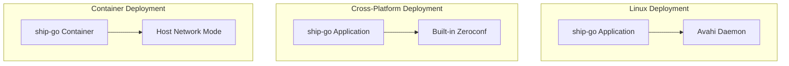

### Configuration Requirements
- **Certificate**: Valid X.509 certificate with EEBUS extensions
- **Network**: Multicast-enabled network for mDNS
- **Ports**: Configurable WebSocket server port (default: 4712)
- **Permissions**: Network access for mDNS and WebSocket

This architecture provides a robust, secure, and extensible foundation for EEBUS device communication while maintaining clean separation of concerns and platform flexibility.