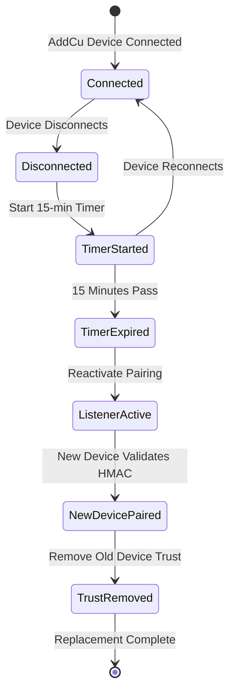
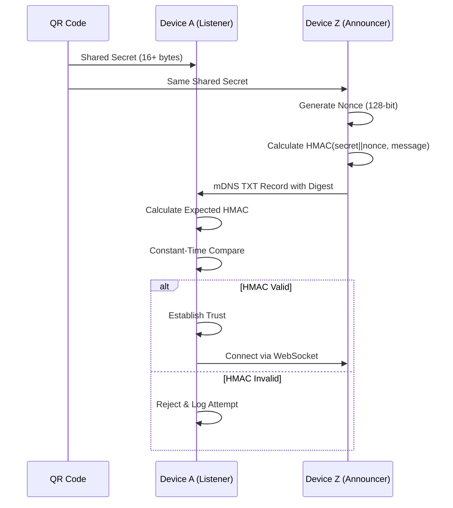
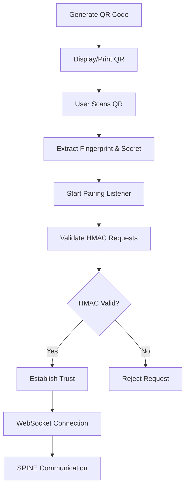
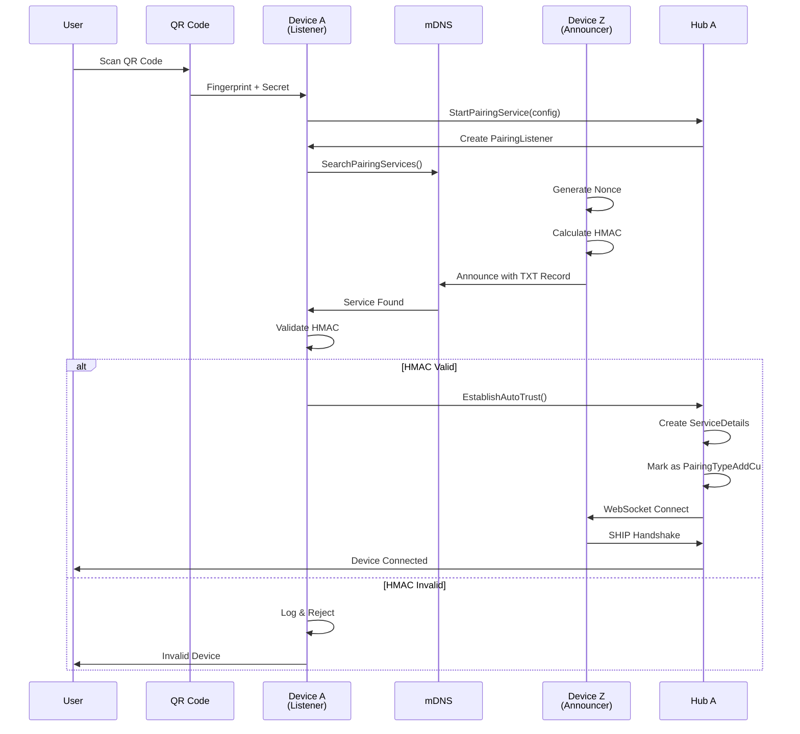
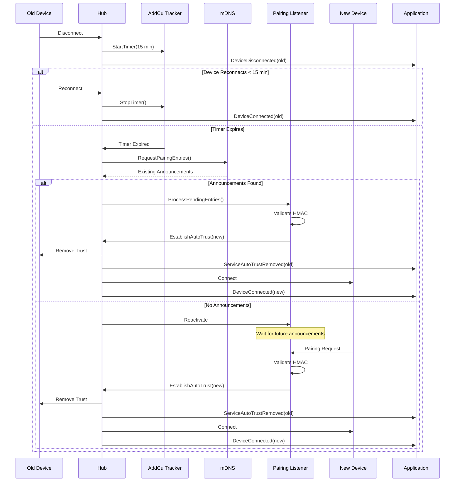
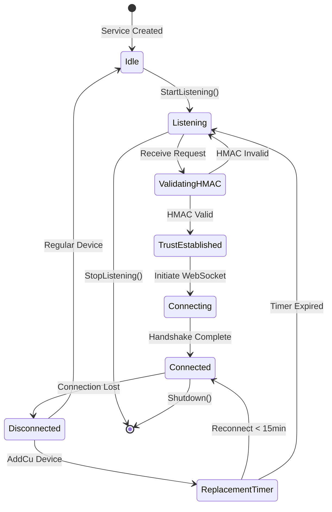

# SHIP Pairing Service Architecture

## Table of Contents

1. [Overview](#overview)
2. [Architecture Components](#architecture-components)
3. [Device Replacement Timing Logic](#device-replacement-timing-logic)
4. [ServiceIdentity Enhancements](#serviceidentity-enhancements)
5. [Hub API Evolution](#hub-api-evolution)
6. [Security Model](#security-model)
7. [QR Code Integration](#qr-code-integration)
8. [Integration Patterns](#integration-patterns)
9. [Flows and Sequences](#flows-and-sequences)
10. [Configuration](#configuration)

## Overview

The SHIP Pairing Service represents a paradigm shift in how smart home devices establish trust relationships. Unlike traditional SHIP 1.0.1 pairing that requires manual approval of each device, the Pairing Service enables automatic trust establishment through cryptographic authentication.

### Key Differences from Traditional SHIP Pairing

| Aspect | Traditional SHIP 1.0.1 | SHIP Pairing Service |
|--------|------------------------|---------------------|
| **Trust Establishment** | Manual user approval | Automatic via HMAC validation |
| **Security Model** | Certificate exchange | QR code + HMAC authentication |
| **User Experience** | Multiple confirmations | Single QR code scan |
| **Device Replacement** | Manual re-pairing | Automatic 15-minute detection |
| **Pairing Speed** | Minutes per device | Seconds per device |
| **Scalability** | Limited by user interaction | Supports bulk deployment |

### Core Concepts

The SHIP Pairing Service introduces several key concepts:

- **Shared Secret**: A cryptographic key embedded in QR codes that authorizes pairing
- **HMAC Authentication**: Cryptographic proof that a device possesses the shared secret
- **Device Fingerprints**: SHA-256 hashes of certificates for additional validation
- **AddCu Devices**: Control units paired via the Pairing Service with special replacement logic
- **Ring Buffer History**: Replay attack prevention through digest tracking

## Architecture Components

The `pairing/` package implements the complete SHIP Pairing Service specification with a clean, modular architecture:

```
pairing/
├── service.go              # Main orchestrator implementing ShipPairingServiceInterface
├── listener.go             # DevA (listener) functionality
├── hmac.go                 # HMAC-SHA256 cryptographic operations
├── ring_buffer.go          # Replay protection history provider
└── hub_integration.go      # Hub coordination layer
```

### Service Orchestrator (service.go)

The `Service` struct acts as the main orchestrator, coordinating all pairing components:

```go
type Service struct {
    listener *PairingListener                    // Pairing listener component
    mdns     api.MdnsPairingInterface            // mDNS discovery
    crypto   api.PairingCryptoInterface          // HMAC operations
    history  api.PairingHistoryProviderInterface // Replay protection (library-managed)
    hub      api.PairingHubInterface             // Hub integration
    localCert *x509.Certificate                  // Local certificate
    running  bool                                // Service state
    mux      sync.RWMutex                        // Thread safety
}
```

Key responsibilities:
- Component lifecycle management
- Certificate fingerprint operations
- Service state coordination
- Clean shutdown handling

### Pairing Listener (listener.go)

The `PairingListener` implements DevA functionality from the SHIP Pairing Service specification:

```go
type PairingListener struct {
    mdns         api.MdnsPairingInterface
    crypto       api.PairingCryptoInterface
    history      api.PairingHistoryProviderInterface  // Library-managed ring buffer
    hub          api.PairingHubInterface
    localService *api.ServiceDetails
    
    // State management
    listening    bool
    secret       api.PairingSecret
    startTime    time.Time
    requestsSeen int
    lastRequest  time.Time
    
    // Concurrency control
    ctx    context.Context
    cancel context.CancelFunc
}
```

Key features:
- Asynchronous mDNS discovery handling
- HMAC validation of incoming requests
- Automatic trust establishment on success
- Graceful context-based cancellation
- **ProcessPendingEntries method** for batch processing of discovered services

#### ProcessPendingEntries Method

The `ProcessPendingEntries` method enables the hub to process already-discovered pairing services without waiting for new mDNS events:

```go
// ProcessPendingEntries processes a batch of pairing entries (implements PairingListenerInterface)
func (l *PairingListener) ProcessPendingEntries(entries map[string]*api.ShipPairingTXT) error {
    if len(entries) == 0 {
        return nil
    }
    
    for _, txtRecord := range entries {
        // Reuse existing handleMdnsDiscovery logic
        shouldContinue := l.handleMdnsDiscovery(txtRecord)
        if !shouldContinue {
            // Successful pairing occurred - stop processing
            break
        }
    }
    
    return nil
}
```

This method is critical for AddCu replacement scenarios where existing mDNS announcements need immediate processing when the replacement timer expires.

### HMAC Calculator (hmac.go)

Implements cryptographic operations per SHIP specification section 7:

```go
type HMACCalculator struct{}

// Key construction: K = devA-secret || devZ-nonce
func (h *HMACCalculator) constructKey(secret PairingSecret, nonce []byte) []byte

// Message construction with fixed field ordering
func (h *HMACCalculator) constructMessage(txtRecord *ShipPairingTXT) string

// Constant-time validation to prevent timing attacks
func (h *HMACCalculator) ValidateDigest(secret PairingSecret, params *HMACParams, expectedDigest []byte) error
```

Security features:
- Cryptographically secure nonce generation
- Constant-time comparison using `crypto/subtle`
- Fixed field ordering per specification
- Binary key concatenation (no encoding)

### Ring Buffer History (ring_buffer.go)

The library provides a complete ring buffer implementation per SHIP specification section 11. Applications only need to provide simple storage operations:

```go
// Library-managed ring buffer (internal to ship-go)
type RingBufferHistoryProvider struct {
    persistence api.RingBufferPersistence  // Application-provided storage
    entries     []api.DigestEntry
    maxSize     int
    next        int              // Next write position
    mux         sync.RWMutex
}

// Application implements only storage interface
type RingBufferPersistence interface {
    LoadRingBuffer() ([]DigestEntry, int, error)  // Load from persistent storage with nextIndex
    SaveRingBuffer(entries []DigestEntry, nextIndex int) error  // Save to persistent storage with nextIndex
}
```

Features:
- **Library manages**: Ring buffer algorithm, wraparound logic, replay detection
- **Application provides**: Simple load/save operations for persistence
- Minimum 10-entry buffer (spec requirement)
- O(1) insertion with wraparound
- O(n) lookup for replay detection
- Thread-safe concurrent access

## Device Replacement Timing Logic

The Device Replacement Timing Logic is a critical feature for AddCu (control unit) devices that enables seamless device replacement without user intervention.

### AddCu Replacement Tracker

The `AddCuReplacementTracker` manages the 15-minute replacement detection window:

```go
type AddCuReplacementTracker struct {
    timeout            time.Duration  // 15 minutes default
    pairedDeviceShipID string        // Currently tracked device
    disconnectionTime  time.Time     // When timer started
    timer              *time.Timer   // Timeout handler
    mutex              sync.RWMutex  // Thread safety
}
```

### Replacement Logic Flow



### Implementation Details

1. **Single Device Tracking**: Only one AddCu device tracked at a time (typical home scenario)
2. **Timer Lifecycle**: Automatic cleanup on expiry or reconnection
3. **Immediate mDNS Processing**: On timer expiry, existing mDNS announcements are checked and processed before reactivating the listener
4. **Callback Mechanism**: Type-safe callbacks with shipID parameter
5. **Process Restart Handling**: Applications should persist disconnection timestamps

#### Timer Expiry Flow

When the 15-minute timer expires, the hub performs these steps:

```go
// handleAddCuReplacementTimeout - called when timer expires
func (h *Hub) handleAddCuReplacementTimeout(expiredShipID string) {
    // 1. Check for existing pairing announcements
    currentPairingServices, _ := h.mdns.RequestPairingEntries()
    
    // 2. If announcements exist and listener is available, process immediately
    if len(currentPairingServices) > 0 && h.activePairingListener != nil {
        // Process existing entries before reactivating listener
        h.activePairingListener.ProcessPendingEntries(currentPairingServices)
    }
    
    // 3. Reactivate pairing listener for future announcements
    h.reactivatePairingListener("AddCu device replacement timeout")
}
```

This immediate processing ensures replacement devices that are already announcing can be paired without waiting for another mDNS discovery cycle.

Example implementation:
```go
// When AddCu device disconnects
tracker.StartTimer(shipID, func(expiredShipID string) {
    log.Printf("Device %s replacement timeout", expiredShipID)
    // Hub will check for existing announcements and process them
    hub.handleAddCuReplacementTimeout(expiredShipID)
})

// When device reconnects
if deviceReconnected {
    tracker.StopTimer(shipID)
}

// After new device successfully pairs
hub.RemoveTrust(oldShipID)
callback.ServiceAutoTrustRemoved(oldServiceIdentity, "replaced")
```

## ServiceIdentity Enhancements

The `ServiceDetails` struct has been enhanced to support the Pairing Service requirements:

### New Fields

```go
type ServiceDetails struct {
    // New fields for Pairing Service
    fingerprint string        // Certificate SHA-256 fingerprint
    pairingType PairingType  // Default or AddCu
    
    // Existing fields
    ski                   string
    shipID                string
    ipv4                  string
    autoAccept            bool
    trusted               bool
    connectionStateDetail *ConnectionStateDetail
    mux                   sync.Mutex
}
```

### PairingType Enumeration

```go
type PairingType int

const (
    PairingTypeDefault PairingType = iota  // Traditional SHIP 1.0.1
    PairingTypeAddCu                      // SHIP Pairing Service
)
```

### Copy Method for Thread Safety

The new `Copy()` method creates safe copies for concurrent operations:

```go
func (s *ServiceDetails) Copy() *ServiceDetails {
    s.mux.Lock()
    defer s.mux.Unlock()
    
    copy := &ServiceDetails{
        fingerprint: s.fingerprint,
        ski:         s.ski,
        shipID:      s.shipID,
        pairingType: s.pairingType,
        // ... copy all fields
    }
    
    // Deep copy connection state
    if s.connectionStateDetail != nil {
        copy.connectionStateDetail = s.connectionStateDetail.Copy()
    }
    
    return copy
}
```

### Multi-Identifier Support

ServiceDetails now supports three identification methods:
1. **SKI**: Primary identifier from X.509 certificates
2. **Fingerprint**: SHA-256 hash for SHIP Pairing Service
3. **SHIP ID**: Unique device identifier for validation

## Hub API Evolution

The Hub interface has evolved significantly to support the SHIP Pairing Service:

### Before (SKI-Centric)

```go
// Old API - string-based SKI methods
hub.ServiceForSKI(ski string) *ServiceDetails
hub.PairingDetailForSki(ski string) *ConnectionStateDetail
hub.RegisterRemoteSKI(ski, shipID string)
hub.UnregisterRemoteSKI(ski string)
hub.DisconnectSKI(ski string, reason string)
```

### After (ServiceIdentity-based with Ring Buffer Support)

```go
// New API - flexible identifier support
hub.ServiceForIdentifier(ski, fingerprint string) *ServiceDetails
hub.PairingDetailForIdentifier(ski, fingerprint string) *ConnectionStateDetail
hub.RegisterRemoteService(ski, fingerprint, shipID string)
hub.UnregisterRemoteService(ski, fingerprint string)
hub.AddService(service *ServiceDetails) bool
hub.RemoveService(ski, fingerprint string)

// Hub constructor now requires RingBufferPersistence (7th parameter)
func NewHub(
    reader HubReaderInterface,
    mdns MdnsInterface,
    port uint,
    certificate tls.Certificate,
    localService *ServiceDetails,
    configuration *Configuration,
    ringBufferPersistence RingBufferPersistence,  // NEW: Application storage
) (*Hub, error)
```

### Ring Buffer Persistence Evolution

The architecture now cleanly separates responsibilities:

**Library (ship-go) manages:**
- Complete ring buffer algorithm per SHIP specification
- Wraparound logic for bounded memory
- Replay attack detection
- Thread-safe access patterns

**Application provides:**
- Simple storage interface (LoadRingBuffer/SaveRingBuffer)
- Persistent storage implementation (file, database, etc.)
- No ring buffer logic needed in application code

### Service Registry Evolution

The hub now uses array-based storage for flexible lookup:

```go
// Array-based storage enables multi-identifier matching
services []*ServiceDetails

// Flexible lookup supporting any identifier
func (h *Hub) ServiceForIdentifier(ski, fingerprint string) *ServiceDetails {
    for _, service := range h.services {
        if (ski != "" && service.SKI() == ski) ||
           (fingerprint != "" && service.Fingerprint() == fingerprint) {
            return service
        }
    }
    return nil
}
```

### Pairing Service Integration

The hub coordinates with the Pairing Service through callbacks:

```go
// Hub implements PairingHubInterface
func (h *Hub) EstablishAutoTrust(request *AutoTrustEstablishmentRequest) *AutoTrustEstablishmentResult {
    // Find or create service
    service := h.ServiceForIdentifier(request.SKI, request.Fingerprint)
    if service == nil {
        service = api.NewServiceDetails(request.SKI, request.Fingerprint, request.ShipID)
        service.SetPairingType(api.PairingTypeAddCu)
        h.AddService(service)
    }
    
    // Mark as trusted
    service.SetTrusted(true)
    
    // Initiate connection
    h.connectToRemoteService(service)
    
    return &AutoTrustEstablishmentResult{
        Success:        true,
        ServiceCreated: serviceCreated,
    }
}
```

### Hub Listener Management

The hub implements intelligent listener reuse to optimize resource usage and ensure thread-safe operations:

```go
// Hub fields for listener management
type Hub struct {
    // Thread-safe listener storage and reuse
    activePairingListener api.PairingListenerInterface
    muxPairingListener    sync.RWMutex
    
    // ... other fields
}

// StartAutonomousListener with double-checked locking pattern
func (h *Hub) StartAutonomousListener(config *api.PairingConfig) error {
    // Thread-safe check and create listener
    h.muxPairingListener.Lock()
    defer h.muxPairingListener.Unlock()
    
    var listener api.PairingListenerInterface
    if h.activePairingListener != nil {
        // Reuse existing listener - important for AddCu replacement scenarios
        listener = h.activePairingListener
    } else {
        // Create new listener through pairing service
        listener = h.pairingService.CreateListener(h.localService)
        if listener == nil {
            return fmt.Errorf("failed to create pairing listener")
        }
        
        // Store the listener for future reuse
        h.activePairingListener = listener
    }
    
    // Start listening with configured secret
    return listener.StartListening(h.pairingCtx, config.Secret)
}
```

Key features of the listener management pattern:
1. **Thread-Safe Storage**: Uses RWMutex to protect concurrent access to the active listener
2. **Listener Reuse**: Reuses existing listener instances when reactivating pairing (e.g., after AddCu timeout)
3. **Double-Checked Locking**: Ensures thread-safe creation and storage of listeners
4. **Lifecycle Management**: Maintains listener reference throughout hub lifetime for efficient reuse

This pattern is especially important for AddCu replacement scenarios where the listener needs to be reactivated multiple times without creating new instances.

## Security Model

The SHIP Pairing Service implements multiple layers of security, with the library ensuring specification compliance:

### 1. HMAC Authentication



### 2. Replay Protection

The library-managed ring buffer prevents replay attacks:

```go
// Library handles all ring buffer logic internally
if history.HasSeenDigest(alg, digest) {
    return ErrReplayAttack
}

// Record successful pairing
history.RecordPairing(alg, digest)

// Application only provides storage
type MyPersistence struct {
    db *Database
}

func (p *MyPersistence) LoadRingBuffer() ([]api.DigestEntry, int, error) {
    return p.db.LoadDigestHistory() // Should return entries, nextIndex, error
}

func (p *MyPersistence) SaveRingBuffer(entries []api.DigestEntry, nextIndex int) error {
    return p.db.SaveDigestHistory(entries, nextIndex)
}
```

Features:
- **Library ensures**: Minimum 10-entry history per spec, wraparound logic
- **Application provides**: Storage operations only
- Clean separation of concerns
- No algorithm duplication across applications

### 3. Constant-Time Validation

Prevents timing attacks through careful implementation:

```go
func ValidateDigest(secret, params, expectedDigest) error {
    calculatedDigest := CalculateDigest(secret, params)
    
    // Constant-time comparison
    if subtle.ConstantTimeCompare(calculatedDigest, expectedDigest) != 1 {
        return ErrInvalidHMACDigest
    }
    return nil
}
```

### 4. Certificate Fingerprint Validation

Additional layer of certificate validation:

```go
func ValidateRemoteFingerprint(remoteCert *x509.Certificate, expectedFingerprint string) error {
    actualFingerprint := sha256.Sum256(remoteCert.Raw)
    expected := hex.DecodeString(expectedFingerprint)
    
    if !bytes.Equal(actualFingerprint[:], expected) {
        return ErrFingerprintMismatch
    }
    return nil
}
```

## QR Code Integration

QR codes enable seamless device discovery and pairing:

### QR Code Format

```
Format: SHIPP:<fingerprint>#<secret>

Example: SHIPP:C74B7855D3479415F62CC01E5F6D9A93EBC676057D85417ADA16FD1384338943#7A37DCF81BDB50F8E92CFA4160CCB3DE
```

Components:
- **SHIPP**: Protocol identifier
- **Fingerprint**: 64-character hex SHA-256 certificate hash
- **Secret**: 32+ character hex shared secret (16+ bytes)

### QR Code Workflow



### Implementation Example

```go
// Parse QR code
func ParseQRCode(qrData string) (*QRCodeData, error) {
    // Format: SHIPP:<fingerprint>#<secret>
    if !strings.HasPrefix(qrData, "SHIPP:") {
        return nil, ErrInvalidQRCode
    }
    
    parts := strings.Split(qrData[6:], "#")
    if len(parts) != 2 {
        return nil, ErrInvalidQRCode
    }
    
    secret, _ := hex.DecodeString(parts[1])
    
    return &QRCodeData{
        Fingerprint: parts[0],
        Secret:      PairingSecret(secret),
    }, nil
}

// Start pairing with QR data
qrData, _ := ParseQRCode(scannedCode)
config := api.NewPairingConfig(api.PairingModeListener, qrData.Secret)
hub.StartPairingService(config)
```

## Integration Patterns

### Basic Integration

```go
// 1. Create hub reader with pairing callbacks
type MyHubReader struct{}

func (r *MyHubReader) ServiceAutoTrusted(identity api.ServiceIdentity) {
    log.Printf("Auto-trusted device: %s", identity.ShipID)
    
    // Convert to ServiceDetails for internal operations
    service := identity.ToServiceDetails()
    if service != nil {
        // Mark as AddCu device for replacement logic
        service.SetPairingType(api.PairingTypeAddCu)
        
        // Store in persistent database
        db.SaveTrustedDevice(service)
    }
}

func (r *MyHubReader) ServiceAutoTrustFailed(identity api.ServiceIdentity, reason error) {
    log.Printf("Auto-trust failed for device %s: %v", identity.ShipID, reason)
    
    // Log security event
    securityLogger.LogPairingFailure(identity.ShipID, reason)
}

func (r *MyHubReader) ServiceAutoTrustRemoved(identity api.ServiceIdentity, reason string) {
    log.Printf("Device %s replaced: %s", identity.ShipID, reason)
    
    // Clean up resources
    db.RemoveTrustedDevice(identity.ShipID)
    
    // Update UI
    ui.NotifyDeviceReplaced(identity)
}

// 2. Initialize hub with pairing support
localService := api.NewServiceDetails(localSKI, localFingerprint, localShipID)

// Create ring buffer persistence (nil for testing, real implementation for production)
var ringBufferPersistence api.RingBufferPersistence
if production {
    ringBufferPersistence = &MyRingBufferStorage{db: database}
}

// Hub constructor requires 7 parameters
hub := hub.NewHub(
    &MyHubReader{},        // 1. Reader callbacks
    mdns,                  // 2. mDNS interface
    port,                  // 3. WebSocket port
    cert,                  // 4. TLS certificate
    localService,          // 5. Local service details
    nil,                   // 6. Configuration (optional)
    ringBufferPersistence, // 7. Ring buffer storage (nil for testing)
)

// 3. Configure pairing from QR code
qrData := parseQRCode(scannedCode)
pairingConfig := api.NewPairingConfig(api.PairingModeListener, qrData.Secret)

// 4. Start hub with pairing
hub.SetPairingConfig(pairingConfig)
hub.Start()
```

### Advanced Integration with Persistence

```go
// Implement ring buffer persistence for production
type ProductionRingBufferStorage struct {
    db *Database
}

func (s *ProductionRingBufferStorage) LoadRingBuffer() ([]api.DigestEntry, int, error) {
    // Load from database on startup
    return s.db.Query("SELECT algorithm, digest, timestamp FROM pairing_history ORDER BY timestamp")
}

func (s *ProductionRingBufferStorage) SaveRingBuffer(entries []api.DigestEntry, nextIndex int) error {
    // Save after each successful pairing
    tx := s.db.Begin()
    defer tx.Rollback()
    
    // Clear old entries
    tx.Exec("DELETE FROM pairing_history")
    
    // Insert current entries
    for _, entry := range entries {
        tx.Exec("INSERT INTO pairing_history (algorithm, digest, timestamp) VALUES (?, ?, ?)",
            entry.Algorithm, entry.Digest, entry.Timestamp)
    }
    
    return tx.Commit()
}

// Store disconnection times for process restarts
type PersistentPairingManager struct {
    hub      api.HubInterface
    tracker  *hub.AddCuReplacementTracker
    db       *Database
}

func (m *PersistentPairingManager) OnDeviceDisconnected(service *api.ServiceDetails) {
    if service.PairingType() == api.PairingTypeAddCu {
        // Store disconnection time
        m.db.StoreDisconnection(service.ShipID(), time.Now())
        
        // Start replacement timer
        m.tracker.StartTimer(service.ShipID(), m.onReplacementTimeout)
    }
}

func (m *PersistentPairingManager) OnStartup() {
    // Initialize hub with persistent ring buffer
    ringBufferStorage := &ProductionRingBufferStorage{db: m.db}
    
    hub, _ := hub.NewHub(
        m,                    // Hub reader
        mdns,                 // mDNS interface
        port,                 // WebSocket port
        cert,                 // TLS certificate
        localService,         // Local service
        config,               // Configuration
        ringBufferStorage,    // Ring buffer persistence
    )
    
    // Restore timers for disconnected AddCu devices
    disconnections := m.db.GetDisconnectedAddCuDevices()
    
    for _, disc := range disconnections {
        elapsed := time.Since(disc.Time)
        if elapsed < 15*time.Minute {
            // Resume timer with remaining time
            remaining := 15*time.Minute - elapsed
            m.tracker.StartTimerWithDuration(disc.ShipID, remaining, m.onReplacementTimeout)
        } else {
            // Timer already expired, reactivate pairing
            m.hub.ReactivatePairingListener()
        }
    }
}
```

### Production Integration Pattern

```go
// Production-ready pairing service integration
type ProductionPairingService struct {
    hub             api.HubInterface
    pairingService  api.ShipPairingServiceInterface
    metrics         *MetricsCollector
    alerting        *AlertManager
    ringBuffer      api.RingBufferPersistence  // Application storage
}

func (s *ProductionPairingService) Initialize(qrSecret []byte) error {
    // Validate secret strength
    if len(qrSecret) < 16 {
        return ErrWeakSecret
    }
    
    // Initialize ring buffer persistence
    s.ringBuffer = &ProductionRingBufferStorage{
        db: s.database,
        maxRetries: 3,
    }
    
    // Create hub with all required parameters
    hub, err := hub.NewHub(
        s,                // Hub reader interface
        s.mdns,           // mDNS discovery
        s.port,           // WebSocket port
        s.cert,           // TLS certificate
        s.localService,   // Local service details
        s.config,         // Hub configuration
        s.ringBuffer,     // Ring buffer persistence (7th parameter)
    )
    if err != nil {
        return err
    }
    s.hub = hub
    
    // Configure with security defaults
    config := &api.PairingConfig{
        Mode:   api.PairingModeListener,
        Secret: api.PairingSecret(qrSecret),
    }
    
    // Setup monitoring
    s.metrics.RegisterPairingMetrics()
    
    // Configure alerts
    s.alerting.ConfigureAlert("pairing_failure", 5*time.Minute)
    s.alerting.ConfigureAlert("replacement_timeout", 16*time.Minute)
    
    // Start service
    return s.hub.SetPairingConfig(config)
}

func (s *ProductionPairingService) OnPairingAttempt(fingerprint string, success bool) {
    s.metrics.RecordPairingAttempt(fingerprint, success)
    
    if !success {
        s.alerting.CheckThreshold("pairing_failure")
    }
}
```

## Flows and Sequences

### Complete Pairing Flow



### Device Replacement Flow



### State Machine



## Configuration

### PairingConfig Structure

```go
type PairingConfig struct {
    Mode   PairingMode   // Off, Listener, Announcer, Both
    Secret PairingSecret // 16+ byte shared secret
}
```

### PairingMode Options

```go
type PairingMode int

const (
    PairingModeOff       PairingMode = iota // Pairing disabled
    PairingModeListener                     // Accept pairing (DevA)
    PairingModeAnnouncer                    // Initiate pairing (DevZ)
    PairingModeBoth                         // Both modes (future)
)
```

### Configuration Validation

```go
func (c *PairingConfig) Validate() error {
    if c == nil {
        return nil // nil config is valid (no pairing)
    }
    
    // Validate secret length for HMAC
    if c.Mode != PairingModeOff && len(c.Secret) > 0 {
        if len(c.Secret) < 16 {
            return ErrInvalidSecret // Too short
        }
        if len(c.Secret) > 128 {
            return ErrInvalidSecret // Too long
        }
    }
    
    return nil
}
```

### Usage Examples

```go
// Basic configuration
config := api.NewPairingConfig(
    api.PairingModeListener,
    secretFromQRCode,
)

// Validate before use
if err := config.Validate(); err != nil {
    log.Fatalf("Invalid config: %v", err)
}

// Apply to hub
hub.SetPairingConfig(config)

// Disable pairing
hub.SetPairingConfig(&api.PairingConfig{
    Mode: api.PairingModeOff,
})

// Dynamic reconfiguration
func updatePairingMode(hub api.HubInterface, newSecret []byte) {
    config := api.NewPairingConfig(
        api.PairingModeListener,
        api.PairingSecret(newSecret),
    )
    hub.SetPairingConfig(config)
}
```

## Best Practices

### 1. Security
- Use minimum 16-byte secrets (128 bits)
- Generate secrets with cryptographically secure random
- Store secrets securely (never in logs or plain text)
- Implement rate limiting for pairing attempts
- Monitor for repeated failed attempts

### 2. Reliability
- Implement RingBufferPersistence for replay protection across restarts
- Persist disconnection timestamps for AddCu devices
- Handle process restarts gracefully
- Implement exponential backoff for reconnections
- Log all pairing events for audit trail

### 3. User Experience
- Provide clear QR code scanning instructions
- Show pairing progress indicators
- Notify users of device replacements
- Support manual override for edge cases

### 4. Testing
- Use specification test vectors for validation
- Test timer edge cases (14:59, 15:00, 15:01)
- Verify thread safety with race detector
- Test network interruption scenarios

### 5. Monitoring
- Track pairing success/failure rates
- Alert on unusual pairing patterns
- Monitor replacement timer expirations
- Log HMAC validation failures

## Summary

The SHIP Pairing Service implementation provides a secure, automated solution for device pairing in smart home environments. By combining QR codes, HMAC authentication, and intelligent device replacement logic, it delivers both strong security and excellent user experience.

Key achievements:
- **Specification Compliance**: Full implementation of SHIP Pairing Service draft with library-managed ring buffer
- **Clean Architecture**: Perfect separation - library handles algorithms, applications provide storage
- **Security**: Multiple layers including HMAC, replay protection, and constant-time validation
- **User Experience**: Single QR scan replaces complex manual pairing
- **Reliability**: Automatic device replacement detection with 15-minute grace period
- **Performance**: Efficient array-based service registry with O(n) lookups
- **Maintainability**: No ring buffer logic duplication - all managed by the library

### Architectural Clarity

The latest evolution introduces perfect separation of concerns:
- **Library (ship-go)**: Implements complete SHIP specification including ring buffer algorithm
- **Applications**: Provide only simple storage operations (LoadRingBuffer/SaveRingBuffer)
- **Hub Constructor**: Now requires 7 parameters with RingBufferPersistence as the 7th
- **Migration Path**: Applications implementing deprecated PairingHistoryProviderInterface should migrate to simpler RingBufferPersistence

The implementation seamlessly integrates with the existing SHIP 1.0.1 infrastructure while adding powerful new capabilities for modern smart home deployments.

### Recent Architectural Improvements

The latest updates to the SHIP Pairing Service architecture include:

1. **ProcessPendingEntries Method**: New PairingListenerInterface method that enables batch processing of discovered pairing services without waiting for new mDNS events. This is critical for AddCu replacement scenarios where immediate processing is required.

2. **Enhanced AddCu Timer Flow**: When the 15-minute replacement timer expires, the hub now immediately checks for and processes existing mDNS announcements before reactivating the listener. This ensures replacement devices that are already announcing can be paired without additional discovery delays.

3. **Intelligent Listener Reuse**: The hub implements thread-safe storage and reuse of pairing listeners using a double-checked locking pattern. This optimization prevents unnecessary listener recreation during AddCu replacement cycles.

4. **Improved Device Replacement Flow**: The sequence now includes explicit mDNS polling (`RequestPairingEntries`) on timer expiry, with immediate processing of found announcements through `ProcessPendingEntries`. This reduces replacement latency and improves user experience.

These improvements ensure robust and efficient device replacement while maintaining full compliance with the SHIP Pairing Service specification.