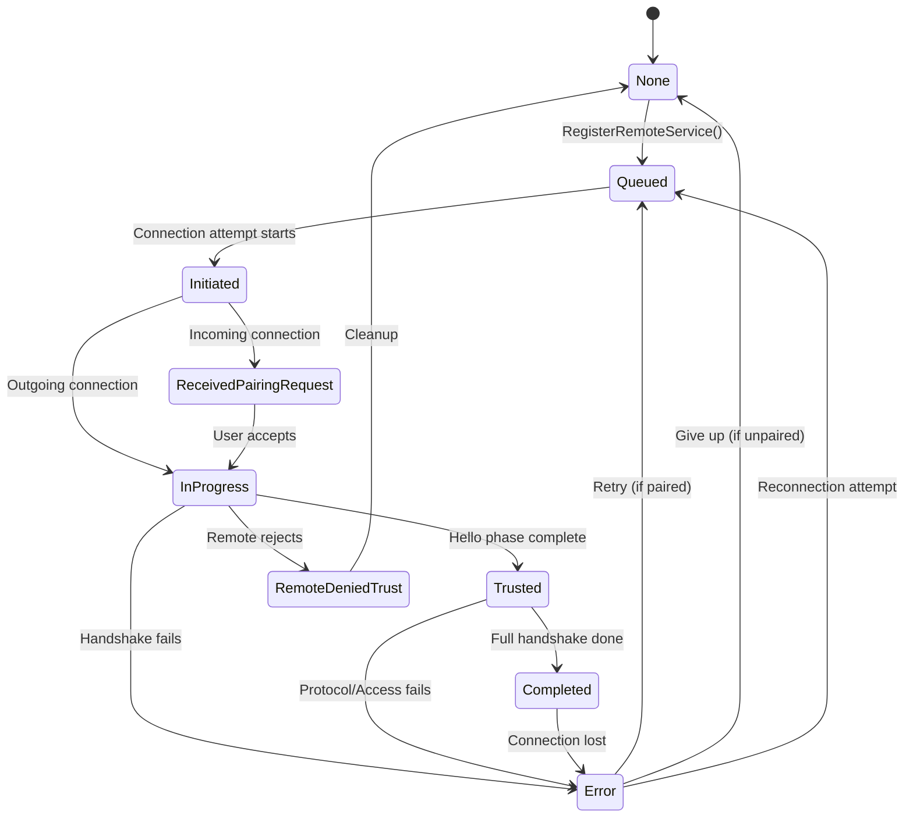

# Connection Lifecycle Guide

This guide explains how ship-go manages SHIP connections from discovery through cleanup. For protocol specifications, see [SHIP TS 1.0.1](https://www.eebus.org/media-downloads/).

## Overview

ship-go implements a comprehensive connection lifecycle with:

- **Two-layer state management** (API states + protocol states)
- **Intelligent reconnection** with exponential backoff
- **Double connection prevention** using SKI-based logic
- **Resource management** with configurable limits
- **Graceful shutdown** with timeout protection

## Connection States

### API-Level States

These states are exposed to applications through `HubReaderInterface`:

```go
const (
    ConnectionStateNone                     = 0  // No connection exists
    ConnectionStateQueued                   = 1  // Connection request queued
    ConnectionStateInitiated                = 2  // This device initiated connection
    ConnectionStateReceivedPairingRequest  = 3  // Remote device initiated
    ConnectionStateInProgress               = 4  // Handshake in progress
    ConnectionStateTrusted                  = 5  // Trust established
    ConnectionStatePin                      = 6  // PIN processing (unused)
    ConnectionStateCompleted                = 7  // Ready for data exchange
    ConnectionStateRemoteDeniedTrust        = 8  // Remote rejected pairing
    ConnectionStateError                    = 9  // Connection failed
)
```

### State Flow Diagram



### State Monitoring

```go
func (reader *MyHubReader) ServiceConnectionStateChanged(ski string, state api.ConnectionState) {
    switch state {
    case api.ConnectionStateQueued:
        log.Info("Connection queued - waiting for slot")
        
    case api.ConnectionStateInitiated:
        log.Info("Connection initiated - starting handshake")
        
    case api.ConnectionStateInProgress:
        log.Info("Handshake in progress - negotiating trust")
        
    case api.ConnectionStateCompleted:
        log.Info("Connection ready - can exchange data")
        reader.spine.StartDeviceCommunication(ski)
        
    case api.ConnectionStateError:
        log.Warning("Connection failed - will retry if paired")
        
    case api.ConnectionStateRemoteDeniedTrust:
        log.Warning("Remote device rejected our pairing request")
    }
}
```

## Reconnection Strategy

### Exponential Backoff Algorithm

ship-go uses intelligent backoff with randomized delays:

```go
// Connection attempt delay ranges
var delayRanges = []delayRange{
    {min: 0,  max: 3},   // 1st attempt: 0-3 seconds
    {min: 3,  max: 10},  // 2nd attempt: 3-10 seconds  
    {min: 10, max: 20},  // 3rd+ attempts: 10-20 seconds
}
```

### Reconnection Behavior

**Automatic Reconnection Occurs When**:
- Device was previously paired and trusted
- Connection lost due to network issues
- Handshake completed successfully at least once

**No Automatic Reconnection When**:
- Device never successfully paired
- Remote explicitly denied trust
- Connection limit exceeded
- Hub is shutting down

### Reconnection Control

```go
// Monitor reconnection attempts
func (reader *MyHubReader) ServiceConnectionStateChanged(ski string, state api.ConnectionState) {
    if state == api.ConnectionStateError {
        // Check if this is a reconnection attempt
        attempt := reader.getAttemptCount(ski)
        log.Printf("Connection failed (attempt %d), will retry in %ds", 
            attempt, reader.getNextDelay(attempt))
    }
}

// Disable reconnection for specific device
hub.UnregisterRemoteService(ski) // Removes from paired devices

// Re-enable reconnection
hub.RegisterRemoteService(ski, shipID) // Re-adds to paired devices
```

## Double Connection Prevention

### ship-go's Approach

ship-go deviates from SHIP specification for practical reasons:

**SHIP Spec**: Keep "most recent" connection (problematic in distributed systems)  
**ship-go**: Use "connection initiator" logic based on SKI comparison

### Prevention Algorithm

```go
func determineConnectionToKeep(localSKI, remoteSKI string, incomingRequest bool) bool {
    if incomingRequest {
        // For incoming connections: keep if remote SKI is higher
        return remoteSKI > localSKI
    } else {
        // For outgoing connections: keep if local SKI is higher
        return localSKI > remoteSKI
    }
}
```

### Result

- **Higher SKI device**: Keeps its outgoing connection
- **Lower SKI device**: Accepts incoming connection from higher SKI
- **Deterministic**: No race conditions or timing dependencies
- **Symmetric**: Both devices reach same decision

### Example

```
Device A (SKI: a1b2c3...)  ←→  Device B (SKI: f9e8d7...)
```

Since B's SKI > A's SKI:
- **Device A**: Accepts incoming connection from B, drops its outgoing attempt
- **Device B**: Keeps its outgoing connection to A, rejects incoming from A

## Resource Management

### Connection Limits

```go
// Default connection limit
const DefaultMaxConnections = 10

// Configure limits based on device capability
hub.SetMaxConnections(20) // Increase for powerful devices
hub.SetMaxConnections(5)  // Decrease for constrained devices
```

### Limit Enforcement

**When Limit Reached**:
- **Incoming connections**: Receive HTTP 503 Service Unavailable
- **Outgoing connections**: Return error from `ConnectSKI()`
- **Existing connections**: Continue normally

**Connection Prioritization**:
- Established connections have priority
- New connections queued if under limit
- No preemption of existing connections

### Resource Monitoring

```go
func (reader *MyHubReader) RemoteSKIConnected(ski string) {
    connectionCount := hub.GetConnectionCount()
    maxConnections := hub.GetMaxConnections()
    
    log.Printf("Connections: %d/%d", connectionCount, maxConnections)
    
    if connectionCount > maxConnections * 0.8 {
        log.Warning("Approaching connection limit")
        reader.notifyHighConnectionUsage()
    }
}
```

## Graceful Shutdown

### Shutdown Sequence

ship-go implements a multi-phase shutdown process:

```go
func (hub *Hub) Shutdown() {
    // Phase 1: Stop accepting new connections (5s timeout)
    hub.httpServer.Shutdown(context.WithTimeout(5 * time.Second))
    
    // Phase 2: Stop mDNS announcements
    hub.mdns.Stop()
    
    // Phase 3: Cancel pending connection attempts
    hub.cancelAllDelayTimers()
    
    // Phase 4: Close existing connections gracefully (3s timeout)
    hub.closeAllConnections(3 * time.Second)
}
```

### Connection Closure Protocol

Each connection follows SHIP closure protocol:

```go
// 1. Send connection close with "announce" phase
closeMsg := &model.ConnectionClose{
    ConnectionClose: model.ConnectionCloseType{
        Phase: util.Ptr(model.ConnectionClosePhaseTypeAnnounce),
    },
}

// 2. Wait for confirmation (500ms timeout)
select {
case <-confirmationReceived:
    log.Debug("Graceful close confirmed")
case <-time.After(500 * time.Millisecond):
    log.Debug("Close confirmation timeout")
}

// 3. Close WebSocket connection
websocket.Close()
```

### Production Shutdown Example

```go
func main() {
    // Setup signal handling
    sigChan := make(chan os.Signal, 1)
    signal.Notify(sigChan, os.Interrupt, syscall.SIGTERM)
    
    // Start hub
    hub := createHub()
    hub.Start()
    
    // Wait for shutdown signal
    <-sigChan
    log.Info("Shutting down...")
    
    // Graceful shutdown with timeout
    done := make(chan bool, 1)
    go func() {
        hub.Shutdown()
        done <- true
    }()
    
    select {
    case <-done:
        log.Info("Shutdown completed")
    case <-time.After(10 * time.Second):
        log.Error("Shutdown timeout - forcing exit")
        os.Exit(1)
    }
}
```

## Connection Cleanup

### Automatic Cleanup

ship-go automatically cleans up resources when connections close:

```go
func (hub *Hub) HandleConnectionClosed(ski string) {
    // 1. Remove from connection registry
    hub.unregisterConnection(ski)
    
    // 2. Cancel any pending delay timers
    hub.cancelDelayTimer(ski)
    
    // 3. Clean up handshake state
    hub.cleanupHandshakeState(ski)
    
    // 4. Notify application
    hub.reader.RemoteSKIDisconnected(ski)
    
    // 5. Schedule reconnection (if paired)
    if hub.isPaired(ski) {
        hub.scheduleReconnection(ski)
    }
}
```

### Manual Cleanup

```go
// Remove device completely (no reconnection)
hub.UnregisterRemoteService(ski)

// Force disconnect specific device
hub.DisconnectSKI(ski, "manual disconnect")

// Clear all connections
hub.DisconnectAllSKIs("shutdown")
```

## Connection Coordination

### Concurrent Connection Prevention

ship-go prevents multiple simultaneous connection attempts to the same device:

```go
type ConnectionCoordinator struct {
    activeAttempts map[string]bool
    mutex          sync.Mutex
}

func (c *ConnectionCoordinator) AttemptConnection(ski string) bool {
    c.mutex.Lock()
    defer c.mutex.Unlock()
    
    if c.activeAttempts[ski] {
        return false // Already attempting
    }
    
    c.activeAttempts[ski] = true
    return true
}
```

### Registry Operations

All connection registry operations are atomic:

```go
// Thread-safe connection registration
func (hub *Hub) registerConnection(ski string, conn ShipConnectionInterface) {
    hub.connectionMutex.Lock()
    defer hub.connectionMutex.Unlock()
    
    // Cancel any pending delays
    hub.cancelDelayTimer_Unsafe(ski)
    
    // Add to registry
    hub.connections[ski] = conn
    
    // Reset attempt counter
    hub.connectionAttempts[ski] = 0
}
```

## Performance Considerations

### Memory Usage Per Connection

- **Connection state**: ~100 bytes
- **Handshake state**: ~200 bytes  
- **Timer objects**: ~50 bytes
- **Registry entries**: ~100 bytes
- **Total per connection**: ~450 bytes

### CPU Overhead

- **State transitions**: O(1) with mutex locks
- **Timer management**: Single goroutine per connection
- **Registry operations**: O(1) hash map lookups
- **Message processing**: Minimal overhead for connection management

### Scalability Guidelines

```go
// Recommended limits by device type
var connectionLimits = map[string]int{
    "Raspberry Pi 3":     10,  // Default
    "Raspberry Pi 4":     20,  // More RAM
    "Industrial Gateway": 50,  // Dedicated hardware
    "Desktop/Server":     100, // Development only
}
```

## Monitoring and Metrics

### Connection Health Monitoring

```go
type ConnectionMonitor struct {
    connectionDurations map[string]time.Time
    metrics            *ConnectionMetrics
}

func (m *ConnectionMonitor) OnConnectionStateChanged(ski string, state api.ConnectionState) {
    switch state {
    case api.ConnectionStateInitiated:
        m.connectionDurations[ski] = time.Now()
        
    case api.ConnectionStateCompleted:
        duration := time.Since(m.connectionDurations[ski])
        m.metrics.RecordConnectionTime(duration)
        delete(m.connectionDurations, ski)
        
    case api.ConnectionStateError:
        m.metrics.IncrementConnectionFailures()
        delete(m.connectionDurations, ski)
    }
}
```

### Key Metrics to Track

1. **Connection Success Rate**: Completed / Attempted
2. **Average Connection Time**: Time from Initiated to Completed
3. **Reconnection Frequency**: Failed connections per hour
4. **Resource Utilization**: Active connections / Limit
5. **Graceful Shutdown Time**: Time to close all connections

## Troubleshooting Connection Issues

### Common Connection Patterns

**Successful Connection**:
```
Queued → Initiated → InProgress → Trusted → Completed
```

**Trust Rejected**:
```
Queued → Initiated → InProgress → RemoteDeniedTrust → None
```

**Network Failure**:
```
Queued → Initiated → Error → Queued (retry)
```

**Double Connection**:
```
Device A: Initiated → Error (connection closed by higher SKI)
Device B: ReceivedPairingRequest → InProgress → Completed
```

### Debug Connection State

```go
func debugConnectionState(hub *Hub, ski string) {
    state := hub.GetConnectionState(ski)
    isPaired := hub.IsRemoteServicePaired(ski)
    attemptCount := hub.GetConnectionAttemptCount(ski)
    
    log.Printf("Device %s: state=%v, paired=%v, attempts=%d", 
        ski, state, isPaired, attemptCount)
    
    if conn := hub.GetConnection(ski); conn != nil {
        log.Printf("  Active connection: %v", conn.IsConnected())
    }
}
```

For specific connection error troubleshooting, see [ERROR_HANDLING.md](ERROR_HANDLING.md) and [TROUBLESHOOTING.md](TROUBLESHOOTING.md).