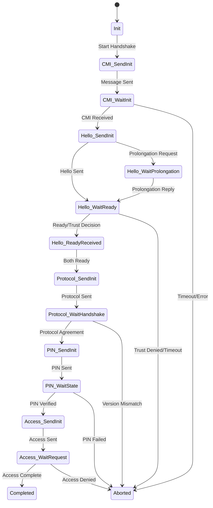

# SHIP Handshake State Machine Guide

This guide explains the SHIP handshake state machine implementation in ship-go. For protocol specifications, see [SHIP TS 1.0.1 Section 13.4.4](https://www.eebus.org/media-downloads/).

## Overview

The SHIP handshake establishes secure, trusted connections between devices through a 5-phase protocol:

1. **CMI** (Connection Mode Init) - Initial connection setup
2. **Hello** - Trust establishment and timing negotiation
3. **Protocol** - Protocol version negotiation
4. **PIN** - PIN verification (ship-go supports "none" only)
5. **Access** - Access methods exchange

Each phase has specific states, timeouts, and error conditions.

## State Machine Architecture

### State Numbering System

ship-go uses a numbered state system (0-39) for debugging and logging:

```go
// Example state numbers
const (
    HandshakeStateInit                    = 0   // Initial state
    HandshakeStateCmiSendInit            = 1   // CMI phase
    HandshakeStateHelloSendInit          = 8   // Hello phase  
    HandshakeStateProtocolSendInit       = 16  // Protocol phase
    HandshakeStatePinSendInit            = 24  // PIN phase
    HandshakeStateAccessSendInit         = 32  // Access phase
    HandshakeStateCompleted              = 38  // Success
    HandshakeStateAborted                = 39  // Failure
)
```

### State Transition Flow



## Phase Details

### 1. CMI (Connection Mode Init) Phase

**Purpose**: Initialize connection with mode selection

**States**:
- `CMI_SendInit` → `CMI_WaitInit` → `Hello_SendInit`

**Timeout**: 10 seconds

**Client Behavior**:
```go
// Client sends CMI first
cmiData := model.ConnectionModeInit{
    ConnectionModeInit: model.ConnectionModeInitType{
        Mode: util.Ptr(model.ConnectionModeTypeAHardConnection),
    },
}
```

**Server Behavior**:
```go
// Server waits for CMI, then responds
// Automatically accepts "AHardConnection" mode
```

**Common Failures**:
- Network connectivity issues
- Protocol version mismatches
- Invalid mode requests

---

### 2. Hello Phase

**Purpose**: Trust establishment and timing negotiation

**States**:
- `Hello_SendInit` → `Hello_WaitReady` → `Protocol_SendInit`
- Alternative: `Hello_WaitProlongation` → `Hello_WaitReady`

**Timeout**: 60 seconds (with prolongation support)

**Trust Decision Flow**:
```go
func (h *HandshakeManager) handleHelloTrust(ski string) bool {
    // Call user implementation
    return h.hubReader.AllowWaitingForTrust(ski)
}
```

**Prolongation Mechanism**:
- If trust decision takes time, devices can request prolongation
- Extends timeout for user interaction
- Minimum prolongation: 1 second (security protection)

**Key Messages**:
```go
// Hello message structure
hello := model.ConnectionHello{
    ConnectionHello: model.ConnectionHelloType{
        WaitingForTrust:    util.Ptr(true),
        ProlongationRequest: util.Ptr(30), // seconds
    },
}
```

**Common Failures**:
- User rejects trust (`AllowWaitingForTrust()` returns false)
- Hello timeout (exceeds 60 seconds)
- Invalid prolongation requests (< 1 second)

---

### 3. Protocol Phase

**Purpose**: Negotiate protocol versions and features

**States**:
- `Protocol_SendInit` → `Protocol_WaitHandshake` → `PIN_SendInit`

**Timeout**: 10 seconds

**Protocol Negotiation**:
```go
// Client proposes protocols
protocolHandshake := model.MessageProtocolHandshake{
    MessageProtocolHandshakeType: model.MessageProtocolHandshakeType{
        Version:     model.Version{Major: 1, Minor: 0, Patch: 0},
        Formats:     []model.MessageProtocolFormatType{model.MessageProtocolFormatTypeUTF8},
    },
}
```

**ship-go Support**:
- **Version**: 1.0.0 (SHIP TS 1.0.1)
- **Format**: UTF8 only (UTF16 not implemented)
- **Features**: Basic protocol set

**Common Failures**:
- Version incompatibility
- Unsupported message formats
- Protocol feature mismatches

---

### 4. PIN Phase

**Purpose**: Additional authentication (ship-go: "none" only)

**States**:
- `PIN_SendInit` → `PIN_WaitState` → `Access_SendInit`

**Timeout**: 10 seconds

**ship-go Implementation**:
```go
// Only supports "none" PIN state
pinState := model.ConnectionPinState{
    ConnectionPinState: model.ConnectionPinStateType{
        PinState: util.Ptr(model.PinStateTypeNone),
    },
}
```

**Limitations**:
- No PIN generation or validation
- Cannot achieve second-factor trust levels
- Some devices may require PIN support

**Common Failures**:
- Remote device requires PIN verification
- PIN state mismatches

---

### 5. Access Phase

**Purpose**: Exchange access methods for reverse connections

**States**:
- `Access_SendInit` → `Access_WaitRequest` → `Completed`

**Timeout**: 10 seconds

**Access Methods**:
```go
// Minimal implementation
accessMethods := model.AccessMethodsType{
    Id: h.localService.ID(),
    // DNS/mDNS information not populated
}
```

**Limitations**:
- Only exchanges device IDs
- No DNS or mDNS reverse connection info
- Limited cloud integration support

**Common Failures**:
- Access method incompatibilities
- Timeout during exchange

---

## Timer Management

### Timer Types

ship-go uses sophisticated timer management:

```go
type TimerType uint

const (
    TimerTypeWaitForReady TimerType = iota
    TimerTypeSendProlongationRequest
    TimerTypeProlongRequestReply
)
```

### Timer Race Condition Protection

```go
// Atomic timer operations prevent race conditions
func (h *HandshakeManager) startTimer(duration time.Duration, timerType TimerType) {
    h.mux.Lock()
    defer h.mux.Unlock()
    
    // Cancel existing timer
    h.stopTimer_Unsafe()
    
    // Start new timer with atomic reference
    h.timer = time.AfterFunc(duration, func() {
        h.handleTimeout(timerType)
    })
}
```

### Production vs Test Timeouts

```go
// Production timeouts (ship-go default)
HelloTimeout:    60 * time.Second,
ProtocolTimeout: 10 * time.Second,

// Test timeouts (with build tag 'test')
HelloTimeout:    500 * time.Millisecond,
ProtocolTimeout: 500 * time.Millisecond,
```

## Error Handling

### Terminal Errors

All handshake errors are **terminal** - no automatic recovery:

```go
func (h *HandshakeManager) handleError(err error) {
    h.setState(HandshakeStateAborted)
    h.stopTimer()
    h.closeConnection()
    h.notifyError(err)
}
```

### Error Categories

1. **Timeout Errors**: Phase exceeded time limit
2. **Protocol Errors**: Invalid messages or versions
3. **Trust Errors**: User or policy rejection
4. **Network Errors**: Connection loss during handshake

### Error Recovery

```go
// Applications must handle connection errors and retry
func (reader *MyHubReader) RemoteSKIDisconnected(ski string) {
    // Log the disconnection
    log.Printf("Device %s disconnected", ski)
    
    // Implement reconnection logic
    go func() {
        time.Sleep(5 * time.Second)
        hub.ConnectSKI(ski, true) // Retry connection
    }()
}
```

## Debugging Handshake Issues

### Enable State Logging

```go
// HandshakeManager logs state transitions
log.Printf("Handshake state: %d -> %d", oldState, newState)
```

### Monitor State Transitions

```go
func (reader *MyHubReader) ServiceConnectionStateChanged(ski string, state api.ConnectionState) {
    switch state {
    case api.ConnectionStateQueued:
        log.Debug("Connection queued - waiting to start")
    case api.ConnectionStateInitiated:
        log.Debug("Connection initiated - CMI phase starting")
    case api.ConnectionStateInProgress:
        log.Debug("Handshake in progress - trust/protocol negotiation")
    case api.ConnectionStateCompleted:
        log.Info("Handshake completed successfully")
    case api.ConnectionStateError:
        log.Error("Handshake failed - check logs for details")
    }
}
```

### Common Debug Scenarios

**1. Hello Phase Timeout**
```bash
# Look for these log patterns:
"Handshake state: 8 -> 39"  # Hello timeout
"AllowWaitingForTrust returned false"
"Hello phase exceeded 60 seconds"
```

**2. Protocol Mismatch**
```bash
# Protocol negotiation failure:
"Handshake state: 16 -> 39"  # Protocol phase failed
"Unsupported protocol version"
"Message format not supported"
```

**3. Trust Rejection**
```bash
# User rejected pairing:
"Trust denied for device: a1b2c3..."
"AllowWaitingForTrust returned false"
```

## Performance Considerations

### Memory Usage

- Each handshake maintains minimal state (~200 bytes)
- Timers use single goroutine per connection
- No message buffering during handshake

### CPU Usage

- State transitions are O(1) operations
- Timer management has minimal overhead
- No cryptographic operations in handshake itself

### Connection Limits

```go
// Default connection limit prevents resource exhaustion
hub.SetMaxConnections(10) // Adjust based on device capacity
```

## Extension Points

### Custom Trust Logic

```go
type AdvancedHubReader struct {
    trustedDevices map[string]bool
    pendingApprovals map[string]chan bool
}

func (h *AdvancedHubReader) AllowWaitingForTrust(ski string) bool {
    // Check pre-approved devices
    if h.trustedDevices[ski] {
        return true
    }
    
    // Async user approval with timeout
    approval := make(chan bool, 1)
    h.pendingApprovals[ski] = approval
    
    go h.promptUserForApproval(ski, approval)
    
    select {
    case result := <-approval:
        return result
    case <-time.After(30 * time.Second):
        return false // Timeout
    }
}
```

### Handshake Monitoring

```go
type HandshakeMonitor struct {
    startTimes map[string]time.Time
    metrics    *HandshakeMetrics
}

func (m *HandshakeMonitor) OnStateChange(ski string, oldState, newState int) {
    if newState == HandshakeStateCompleted {
        duration := time.Since(m.startTimes[ski])
        m.metrics.RecordHandshakeTime(duration)
    }
}
```

## Summary

The SHIP handshake state machine in ship-go provides:

1. **Robust state management** with proper error handling
2. **Flexible trust establishment** through user callbacks
3. **Sophisticated timer management** with race condition protection
4. **Comprehensive debugging** through state logging
5. **Production-ready implementation** with resource limits

Key limitations:
- PIN verification limited to "none" state
- Access methods provide minimal reverse connection info
- All handshake errors are terminal (no automatic recovery)

For troubleshooting specific handshake issues, see [ERROR_HANDLING.md](ERROR_HANDLING.md) and [TROUBLESHOOTING.md](TROUBLESHOOTING.md).