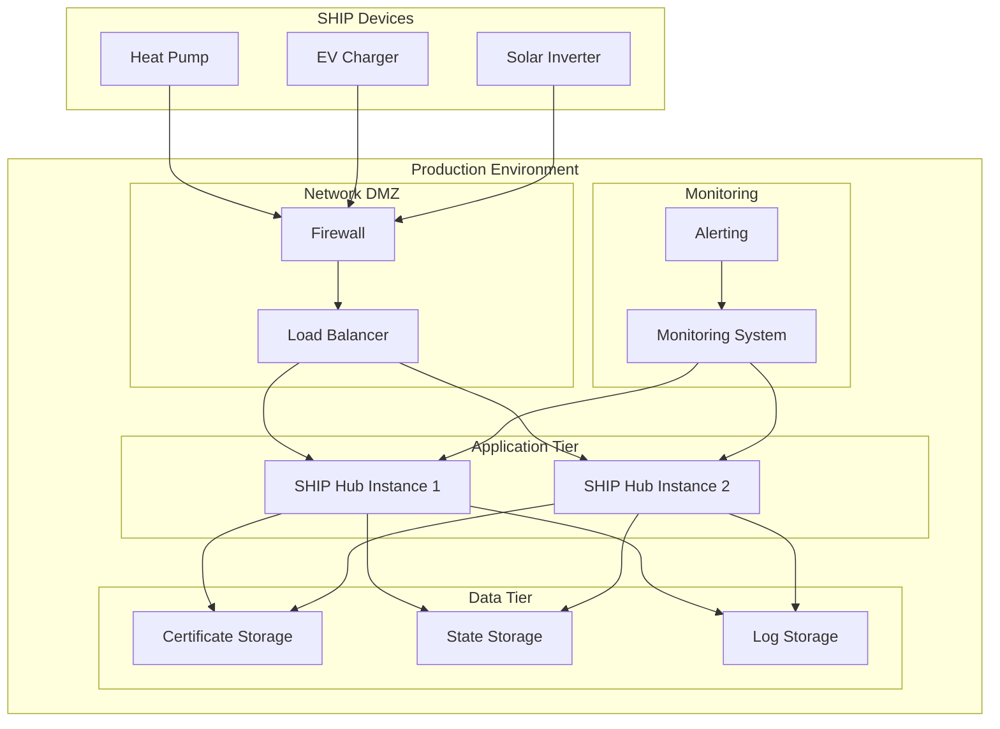
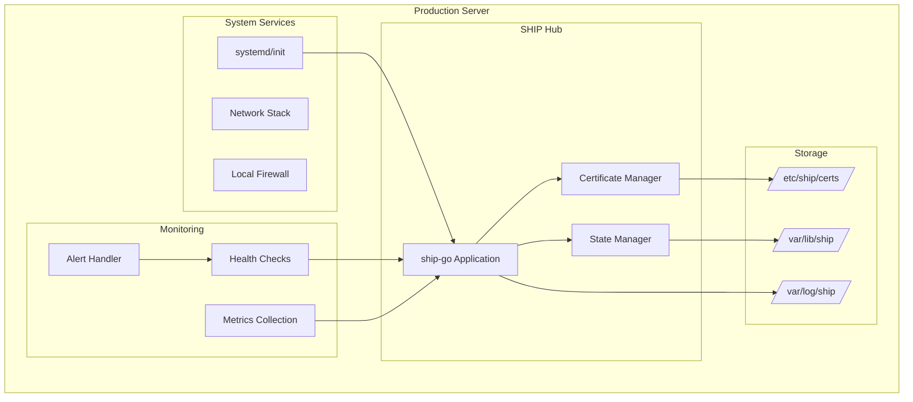

# Production Deployment Guide

This guide covers deploying ship-go in production environments with proper security, monitoring, and operational practices.

## Pre-Deployment Checklist

### Security Requirements ✅

- [ ] **Auto-accept pairing disabled** (`AutoAcceptPairing: false`)
- [ ] **Certificate files secured** (600/644 permissions)
- [ ] **Private keys encrypted** or in secure storage
- [ ] **Trusted devices file protected** (600 permissions)
- [ ] **Network segmentation** configured
- [ ] **Firewall rules** configured for port 4712
- [ ] **User authentication** implemented for pairing

### Performance Requirements ✅

- [ ] **Connection limits** configured for device capacity
- [ ] **Resource monitoring** implemented
- [ ] **Health checks** configured
- [ ] **Graceful shutdown** implemented
- [ ] **Memory limits** configured
- [ ] **Log rotation** configured

### Operational Requirements ✅

- [ ] **Service management** (systemd/init)
- [ ] **Monitoring and alerting** configured
- [ ] **Backup procedures** for certificates and trusted devices
- [ ] **Update procedures** documented
- [ ] **Rollback procedures** tested
- [ ] **Documentation** complete

## Deployment Architecture

### Recommended Deployment



### Single Instance Deployment

For smaller deployments, a single instance with proper monitoring:



## System Configuration

### 1. User and Directory Setup

```bash
# Create system user
sudo useradd -r -s /bin/false -d /opt/ship-hub shipuser

# Create directory structure
sudo mkdir -p /opt/ship-hub/{bin,config,certs,data,logs}
sudo mkdir -p /var/log/ship-hub
sudo mkdir -p /etc/ship-hub

# Set ownership
sudo chown -R shipuser:shipuser /opt/ship-hub
sudo chown -R shipuser:shipuser /var/log/ship-hub
sudo chown -R shipuser:shipuser /etc/ship-hub
```

### 2. File Permissions

```bash
# Application files
sudo chmod 755 /opt/ship-hub/bin/ship-hub
sudo chmod 644 /opt/ship-hub/config/config.json

# Certificate files
sudo chmod 600 /opt/ship-hub/certs/ship.key
sudo chmod 644 /opt/ship-hub/certs/ship.crt

# Data files
sudo chmod 600 /opt/ship-hub/data/trusted_devices.json
sudo chmod 644 /opt/ship-hub/data/hub_state.json

# Log files
sudo chmod 644 /var/log/ship-hub/hub.log
```

### 3. Network Configuration

```bash
# Configure firewall
sudo ufw allow 4712/tcp comment "SHIP protocol"

# For restrictive environments, limit to specific networks
sudo ufw allow from 192.168.1.0/24 to any port 4712

# Enable IP forwarding for Docker deployments
echo 'net.ipv4.ip_forward=1' | sudo tee -a /etc/sysctl.conf
sudo sysctl -p
```

### 4. System Limits

```bash
# Create limits configuration
sudo tee /etc/security/limits.d/ship-hub.conf << EOF
shipuser soft nofile 65536
shipuser hard nofile 65536
shipuser soft nproc 4096
shipuser hard nproc 4096
EOF

# Configure systemd limits
sudo mkdir -p /etc/systemd/system/ship-hub.service.d
sudo tee /etc/systemd/system/ship-hub.service.d/limits.conf << EOF
[Service]
LimitNOFILE=65536
LimitNPROC=4096
EOF
```

## Production Configuration

### 1. Configuration Template

```json
{
  "device_brand": "YourCompany",
  "device_model": "ProductionGateway",
  "device_type": "EnergyManager",
  "device_serial": "PG-2024-001",
  "organization": "Your Company Ltd",
  "country": "DE",
  "port": 4712,
  "max_connections": 50,
  "auto_accept_pairing": false,
  "trusted_devices_file": "/opt/ship-hub/data/trusted_devices.json",
  "certificate_file": "/opt/ship-hub/certs/ship.crt",
  "private_key_file": "/opt/ship-hub/certs/ship.key",
  "state_file": "/opt/ship-hub/data/hub_state.json",
  "log_level": "info",
  "metrics_enabled": true,
  "network_interfaces": ["eth0"],
  "health_check_interval": 60,
  "metrics_report_interval": 300,
  "connection_timeout": 30,
  "reconnect_delay_max": 300
}
```

### 2. Environment-Specific Settings

**Development**:
```json
{
  "log_level": "debug",
  "max_connections": 5,
  "auto_accept_pairing": true,
  "metrics_enabled": false
}
```

**Staging**:
```json
{
  "log_level": "info",
  "max_connections": 10,
  "auto_accept_pairing": false,
  "metrics_enabled": true
}
```

**Production**:
```json
{
  "log_level": "warn",
  "max_connections": 50,
  "auto_accept_pairing": false,
  "metrics_enabled": true
}
```

## Service Management

### 1. systemd Service

Create `/etc/systemd/system/ship-hub.service`:

```ini
[Unit]
Description=SHIP Hub Service
Documentation=https://github.com/enbility/ship-go
After=network.target network-online.target
Wants=network-online.target
AssertFileIsExecutable=/opt/ship-hub/bin/ship-hub

[Service]
Type=simple
User=shipuser
Group=shipuser
WorkingDirectory=/opt/ship-hub
ExecStart=/opt/ship-hub/bin/ship-hub /opt/ship-hub/config/config.json
ExecReload=/bin/kill -HUP $MAINPID
KillMode=mixed
KillSignal=SIGINT
TimeoutStopSec=30

# Restart policy
Restart=always
RestartSec=10
StartLimitIntervalSec=60
StartLimitBurst=3

# Security settings
NoNewPrivileges=true
PrivateTmp=true
ProtectSystem=strict
ProtectHome=true
ReadWritePaths=/opt/ship-hub/data /var/log/ship-hub
CapabilityBoundingSet=CAP_NET_BIND_SERVICE

# Resource limits
LimitNOFILE=65536
LimitNPROC=4096
MemoryMax=1G
CPUQuota=200%

# Logging
StandardOutput=journal
StandardError=journal
SyslogIdentifier=ship-hub

[Install]
WantedBy=multi-user.target
```

### 2. Service Operations

```bash
# Install and start service
sudo systemctl daemon-reload
sudo systemctl enable ship-hub
sudo systemctl start ship-hub

# Check status
sudo systemctl status ship-hub

# View logs
sudo journalctl -u ship-hub -f

# Restart service
sudo systemctl restart ship-hub

# Stop service
sudo systemctl stop ship-hub
```

## Monitoring and Alerting

### 1. Health Monitoring

```bash
#!/bin/bash
# /opt/ship-hub/scripts/health-check.sh

SERVICE_NAME="ship-hub"
LOG_FILE="/var/log/ship-hub/health-check.log"
ALERT_THRESHOLD=3

check_service_status() {
    if ! systemctl is-active --quiet $SERVICE_NAME; then
        echo "$(date): ERROR - Service $SERVICE_NAME is not running" >> $LOG_FILE
        return 1
    fi
    return 0
}

check_port_listening() {
    if ! netstat -tuln | grep -q ":4712 "; then
        echo "$(date): ERROR - Port 4712 not listening" >> $LOG_FILE
        return 1
    fi
    return 0
}

check_connection_count() {
    # Extract connection count from recent logs
    CONN_COUNT=$(journalctl -u $SERVICE_NAME --since "1 minute ago" | grep -o "connections=[0-9]*" | tail -1 | cut -d'=' -f2)
    
    if [ -n "$CONN_COUNT" ] && [ "$CONN_COUNT" -gt 40 ]; then
        echo "$(date): WARNING - High connection count: $CONN_COUNT" >> $LOG_FILE
        return 1
    fi
    return 0
}

check_error_rate() {
    ERROR_COUNT=$(journalctl -u $SERVICE_NAME --since "5 minutes ago" | grep -c "ERROR\|FATAL")
    
    if [ "$ERROR_COUNT" -gt "$ALERT_THRESHOLD" ]; then
        echo "$(date): WARNING - High error rate: $ERROR_COUNT errors in 5 minutes" >> $LOG_FILE
        return 1
    fi
    return 0
}

main() {
    echo "$(date): Starting health check" >> $LOG_FILE
    
    FAILURES=0
    
    check_service_status || ((FAILURES++))
    check_port_listening || ((FAILURES++))
    check_connection_count || ((FAILURES++))
    check_error_rate || ((FAILURES++))
    
    if [ $FAILURES -gt 0 ]; then
        echo "$(date): Health check failed with $FAILURES issues" >> $LOG_FILE
        exit 1
    fi
    
    echo "$(date): Health check passed" >> $LOG_FILE
    exit 0
}

main "$@"
```

### 2. Metrics Collection

```bash
#!/bin/bash
# /opt/ship-hub/scripts/collect-metrics.sh

METRICS_FILE="/var/log/ship-hub/metrics.log"
TIMESTAMP=$(date '+%Y-%m-%d %H:%M:%S')

# System metrics
CPU_USAGE=$(ps -C ship-hub -o %cpu= | awk '{sum += $1} END {print sum}')
MEMORY_USAGE=$(ps -C ship-hub -o %mem= | awk '{sum += $1} END {print sum}')
GOROUTINES=$(pgrep ship-hub | xargs -I {} cat /proc/{}/status | grep -c "Name:")

# Connection metrics from recent logs
ACTIVE_CONNECTIONS=$(journalctl -u ship-hub --since "1 minute ago" | grep -o "connections=[0-9]*" | tail -1 | cut -d'=' -f2)
TOTAL_CONNECTIONS=$(journalctl -u ship-hub --since "1 minute ago" | grep -o "total=[0-9]*" | tail -1 | cut -d'=' -f2)
FAILED_CONNECTIONS=$(journalctl -u ship-hub --since "1 minute ago" | grep -o "failed=[0-9]*" | tail -1 | cut -d'=' -f2)

# Log metrics
echo "$TIMESTAMP,cpu_usage,$CPU_USAGE,memory_usage,$MEMORY_USAGE,goroutines,$GOROUTINES,active_connections,$ACTIVE_CONNECTIONS,total_connections,$TOTAL_CONNECTIONS,failed_connections,$FAILED_CONNECTIONS" >> $METRICS_FILE
```

### 3. Alert Configuration

```bash
#!/bin/bash
# /opt/ship-hub/scripts/alert-handler.sh

ALERT_EMAIL="admin@yourcompany.com"
ALERT_WEBHOOK="https://hooks.slack.com/services/YOUR/WEBHOOK/URL"

send_email_alert() {
    local subject="$1"
    local message="$2"
    
    echo "$message" | mail -s "$subject" "$ALERT_EMAIL"
}

send_webhook_alert() {
    local message="$1"
    
    curl -X POST -H 'Content-type: application/json' \
        --data "{\"text\":\"$message\"}" \
        "$ALERT_WEBHOOK"
}

handle_alert() {
    local alert_type="$1"
    local message="$2"
    
    case "$alert_type" in
        "CRITICAL")
            send_email_alert "CRITICAL: SHIP Hub Alert" "$message"
            send_webhook_alert "🚨 CRITICAL: $message"
            ;;
        "WARNING")
            send_webhook_alert "⚠️ WARNING: $message"
            ;;
        "INFO")
            send_webhook_alert "ℹ️ INFO: $message"
            ;;
    esac
}

# Usage: alert-handler.sh CRITICAL "Service is down"
handle_alert "$1" "$2"
```

## Security Implementation

### 1. Certificate Management

```bash
#!/bin/bash
# /opt/ship-hub/scripts/cert-manager.sh

CERT_DIR="/opt/ship-hub/certs"
CERT_FILE="$CERT_DIR/ship.crt"
KEY_FILE="$CERT_DIR/ship.key"
BACKUP_DIR="/opt/ship-hub/backups/certs"

check_cert_expiry() {
    if [ -f "$CERT_FILE" ]; then
        EXPIRY_DATE=$(openssl x509 -in "$CERT_FILE" -noout -enddate | cut -d'=' -f2)
        EXPIRY_TIMESTAMP=$(date -d "$EXPIRY_DATE" +%s)
        CURRENT_TIMESTAMP=$(date +%s)
        DAYS_UNTIL_EXPIRY=$(( (EXPIRY_TIMESTAMP - CURRENT_TIMESTAMP) / 86400 ))
        
        if [ $DAYS_UNTIL_EXPIRY -lt 30 ]; then
            echo "WARNING: Certificate expires in $DAYS_UNTIL_EXPIRY days"
            return 1
        fi
    fi
    return 0
}

backup_certificate() {
    if [ -f "$CERT_FILE" ] && [ -f "$KEY_FILE" ]; then
        mkdir -p "$BACKUP_DIR"
        BACKUP_TIMESTAMP=$(date +%Y%m%d_%H%M%S)
        cp "$CERT_FILE" "$BACKUP_DIR/ship_$BACKUP_TIMESTAMP.crt"
        cp "$KEY_FILE" "$BACKUP_DIR/ship_$BACKUP_TIMESTAMP.key"
        echo "Certificate backed up to $BACKUP_DIR"
    fi
}

rotate_certificate() {
    echo "Rotating certificate..."
    
    # Backup existing certificate
    backup_certificate
    
    # Stop service
    systemctl stop ship-hub
    
    # Remove old certificate
    rm -f "$CERT_FILE" "$KEY_FILE"
    
    # Start service (will generate new certificate)
    systemctl start ship-hub
    
    echo "Certificate rotation completed"
}

# Check certificate expiry
check_cert_expiry || {
    echo "Certificate expiry warning triggered"
    /opt/ship-hub/scripts/alert-handler.sh WARNING "Certificate expires soon"
}
```

### 2. Security Audit

```bash
#!/bin/bash
# /opt/ship-hub/scripts/security-audit.sh

AUDIT_LOG="/var/log/ship-hub/security-audit.log"
TIMESTAMP=$(date '+%Y-%m-%d %H:%M:%S')

echo "[$TIMESTAMP] Starting security audit" >> $AUDIT_LOG

# Check file permissions
check_file_permissions() {
    local file="$1"
    local expected_perms="$2"
    
    if [ -f "$file" ]; then
        ACTUAL_PERMS=$(stat -c "%a" "$file")
        if [ "$ACTUAL_PERMS" != "$expected_perms" ]; then
            echo "[$TIMESTAMP] WARNING: $file has permissions $ACTUAL_PERMS, expected $expected_perms" >> $AUDIT_LOG
        fi
    fi
}

# Audit critical files
check_file_permissions "/opt/ship-hub/certs/ship.key" "600"
check_file_permissions "/opt/ship-hub/certs/ship.crt" "644"
check_file_permissions "/opt/ship-hub/data/trusted_devices.json" "600"
check_file_permissions "/opt/ship-hub/config/config.json" "644"

# Check for auto-accept configuration
if grep -q '"auto_accept_pairing": true' /opt/ship-hub/config/config.json; then
    echo "[$TIMESTAMP] CRITICAL: Auto-accept pairing is enabled in production!" >> $AUDIT_LOG
fi

# Check trusted devices count
TRUSTED_COUNT=$(jq length /opt/ship-hub/data/trusted_devices.json 2>/dev/null || echo 0)
echo "[$TIMESTAMP] INFO: $TRUSTED_COUNT trusted devices configured" >> $AUDIT_LOG

# Check for suspicious connection patterns
FAILED_CONNECTIONS=$(journalctl -u ship-hub --since "1 hour ago" | grep -c "connection_failed")
if [ "$FAILED_CONNECTIONS" -gt 10 ]; then
    echo "[$TIMESTAMP] WARNING: High number of failed connections: $FAILED_CONNECTIONS" >> $AUDIT_LOG
fi

echo "[$TIMESTAMP] Security audit completed" >> $AUDIT_LOG
```

## Backup and Recovery

### 1. Backup Strategy

```bash
#!/bin/bash
# /opt/ship-hub/scripts/backup.sh

BACKUP_DIR="/opt/ship-hub/backups"
TIMESTAMP=$(date +%Y%m%d_%H%M%S)
BACKUP_NAME="ship-hub-backup-$TIMESTAMP"

create_backup() {
    echo "Creating backup: $BACKUP_NAME"
    
    mkdir -p "$BACKUP_DIR/$BACKUP_NAME"
    
    # Backup configuration
    cp -r /opt/ship-hub/config "$BACKUP_DIR/$BACKUP_NAME/"
    
    # Backup certificates
    cp -r /opt/ship-hub/certs "$BACKUP_DIR/$BACKUP_NAME/"
    
    # Backup data
    cp -r /opt/ship-hub/data "$BACKUP_DIR/$BACKUP_NAME/"
    
    # Create archive
    cd "$BACKUP_DIR"
    tar -czf "$BACKUP_NAME.tar.gz" "$BACKUP_NAME/"
    rm -rf "$BACKUP_NAME"
    
    echo "Backup created: $BACKUP_DIR/$BACKUP_NAME.tar.gz"
}

# Cleanup old backups (keep last 30 days)
cleanup_old_backups() {
    find "$BACKUP_DIR" -name "ship-hub-backup-*.tar.gz" -mtime +30 -delete
}

create_backup
cleanup_old_backups
```

### 2. Recovery Procedures

```bash
#!/bin/bash
# /opt/ship-hub/scripts/restore.sh

BACKUP_FILE="$1"
RESTORE_DIR="/opt/ship-hub/restore"

if [ -z "$BACKUP_FILE" ]; then
    echo "Usage: $0 <backup_file.tar.gz>"
    exit 1
fi

restore_backup() {
    echo "Restoring from: $BACKUP_FILE"
    
    # Stop service
    systemctl stop ship-hub
    
    # Extract backup
    mkdir -p "$RESTORE_DIR"
    tar -xzf "$BACKUP_FILE" -C "$RESTORE_DIR"
    
    # Restore files
    BACKUP_NAME=$(basename "$BACKUP_FILE" .tar.gz)
    cp -r "$RESTORE_DIR/$BACKUP_NAME/config/"* /opt/ship-hub/config/
    cp -r "$RESTORE_DIR/$BACKUP_NAME/certs/"* /opt/ship-hub/certs/
    cp -r "$RESTORE_DIR/$BACKUP_NAME/data/"* /opt/ship-hub/data/
    
    # Fix permissions
    chown -R shipuser:shipuser /opt/ship-hub
    chmod 600 /opt/ship-hub/certs/ship.key
    chmod 644 /opt/ship-hub/certs/ship.crt
    chmod 600 /opt/ship-hub/data/trusted_devices.json
    
    # Start service
    systemctl start ship-hub
    
    # Cleanup
    rm -rf "$RESTORE_DIR"
    
    echo "Restore completed successfully"
}

restore_backup
```

## Troubleshooting Production Issues

### 1. Service Won't Start

```bash
# Check service status
sudo systemctl status ship-hub

# Check logs
sudo journalctl -u ship-hub -n 50

# Check configuration
sudo -u shipuser /opt/ship-hub/bin/ship-hub -test-config /opt/ship-hub/config/config.json

# Check permissions
ls -la /opt/ship-hub/certs/
ls -la /opt/ship-hub/data/
```

### 2. High Resource Usage

```bash
# Monitor resource usage
top -p $(pgrep ship-hub)

# Check memory usage
cat /proc/$(pgrep ship-hub)/status | grep -E "(VmRSS|VmSize)"

# Check file descriptors
lsof -p $(pgrep ship-hub) | wc -l

# Check network connections
netstat -tuln | grep :4712
```

### 3. Connection Issues

```bash
# Check port accessibility
nmap -p 4712 localhost

# Monitor connections
ss -tuln | grep :4712

# Check firewall
sudo ufw status
sudo iptables -L -n | grep 4712

# Test mDNS
avahi-browse -r _ship._tcp
```

## Performance Optimization

### 1. System Tuning

```bash
# Network tuning
echo 'net.core.rmem_max = 16777216' >> /etc/sysctl.conf
echo 'net.core.wmem_max = 16777216' >> /etc/sysctl.conf
echo 'net.ipv4.tcp_rmem = 4096 16384 16777216' >> /etc/sysctl.conf
echo 'net.ipv4.tcp_wmem = 4096 16384 16777216' >> /etc/sysctl.conf

# File descriptor limits
echo 'fs.file-max = 2097152' >> /etc/sysctl.conf

# Apply changes
sysctl -p
```

### 2. Application Tuning

```json
{
  "max_connections": 100,
  "connection_timeout": 15,
  "health_check_interval": 30,
  "metrics_report_interval": 60,
  "reconnect_delay_max": 120
}
```

This production deployment guide provides a comprehensive foundation for running ship-go in production environments with proper security, monitoring, and operational practices.