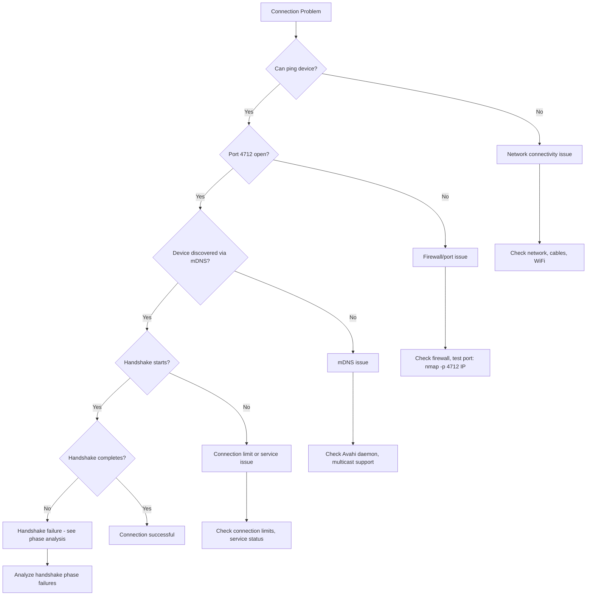

# SHIP Troubleshooting Guide

Comprehensive troubleshooting guide for ship-go SHIP protocol implementation. This guide builds on [ERROR_HANDLING.md](ERROR_HANDLING.md) with systematic debugging approaches.

## Quick Diagnosis

### 1. Connection Issues Flowchart



### 2. Quick Health Check Commands

```bash
# Test basic connectivity
ping <device_ip>

# Test SHIP port
nmap -p 4712 <device_ip>

# Check mDNS discovery
avahi-browse -a | grep ship

# Monitor SHIP traffic
sudo tcpdump -i any port 4712

# Check multicast support
ip route | grep 224
```

## Systematic Debugging Approach

### Phase 1: Environment Verification

#### Network Connectivity
```bash
# Basic reachability
ping -c 3 <device_ip>

# Route to device
traceroute <device_ip>

# Check local network interfaces
ip addr show
```

#### Port Accessibility
```bash
# Test from remote machine
telnet <device_ip> 4712

# Check if port is bound locally
netstat -tulpn | grep 4712

# Test with nmap
nmap -p 4712 -sT <device_ip>
```

#### mDNS/Multicast Support
```bash
# Linux: Check Avahi
systemctl status avahi-daemon
journalctl -u avahi-daemon -f

# Browse all mDNS services
avahi-browse -a

# Test multicast routing
ping -c 3 224.0.0.251  # mDNS multicast address
```

### Phase 2: SHIP Service Verification

#### Service Announcement
```bash
# Check if service is announced
avahi-browse -r _ship._tcp

# Manual mDNS query
dig @224.0.0.251 -p 5353 _ship._tcp.local PTR
```

#### Service Details
```go
// Log service details during announcement
func (reader *MyHubReader) VisibleRemoteServicesUpdated(services []api.RemoteService) {
    for _, service := range services {
        log.Printf("Discovered: SKI=%s, IP=%s, Port=%d, Brand=%s, Model=%s",
            service.Ski, service.IPAddress, service.Port, service.Brand, service.Model)
    }
}
```

### Phase 3: Connection Analysis

#### Connection State Monitoring
```go
type DetailedHubReader struct {
    connectionStartTimes map[string]time.Time
    handshakePhases     map[string][]string
}

func (d *DetailedHubReader) ServiceConnectionStateChanged(ski string, state api.ConnectionState) {
    timestamp := time.Now().Format("15:04:05.000")
    
    switch state {
    case api.ConnectionStateQueued:
        d.connectionStartTimes[ski] = time.Now()
        log.Printf("[%s] %s: QUEUED - Connection request started", timestamp, ski)
        
    case api.ConnectionStateInitiated:
        log.Printf("[%s] %s: INITIATED - Attempting connection", timestamp, ski)
        
    case api.ConnectionStateInProgress:
        log.Printf("[%s] %s: IN_PROGRESS - Handshake started", timestamp, ski)
        
    case api.ConnectionStateCompleted:
        duration := time.Since(d.connectionStartTimes[ski])
        log.Printf("[%s] %s: COMPLETED - Success after %v", timestamp, ski, duration)
        
    case api.ConnectionStateError:
        duration := time.Since(d.connectionStartTimes[ski])
        log.Printf("[%s] %s: ERROR - Failed after %v", timestamp, ski, duration)
    }
}
```

#### Handshake Phase Analysis
```go
// Monitor detailed handshake progress
func (d *DetailedHubReader) ServicePairingDetailUpdate(ski string, detail *api.ConnectionStateDetail) {
    phase := detail.State
    timestamp := time.Now().Format("15:04:05.000")
    
    log.Printf("[%s] %s: Handshake phase %d", timestamp, ski, phase)
    
    // Track phase progression
    if d.handshakePhases[ski] == nil {
        d.handshakePhases[ski] = []string{}
    }
    d.handshakePhases[ski] = append(d.handshakePhases[ski], fmt.Sprintf("%d", phase))
    
    // Detect stuck phases
    if len(d.handshakePhases[ski]) > 10 {
        log.Warning("Handshake may be stuck in phase loops for", ski)
    }
}
```

## Common Problem Scenarios

### Scenario 1: "No Devices Discovered"

**Symptoms**:
- `VisibleRemoteServicesUpdated()` never called
- Empty device list
- No mDNS traffic visible

**Investigation Steps**:

1. **Check mDNS Service**:
```bash
# Linux
systemctl status avahi-daemon
sudo systemctl restart avahi-daemon

# macOS
sudo launchctl unload /System/Library/LaunchDaemons/com.apple.mDNSResponder.plist
sudo launchctl load /System/Library/LaunchDaemons/com.apple.mDNSResponder.plist
```

2. **Verify Multicast Support**:
```bash
# Check multicast route exists
ip route show | grep 224.0.0.0

# Add multicast route if missing
sudo ip route add 224.0.0.0/4 dev eth0
```

3. **Test mDNS Manually**:
```bash
# Browse all services
avahi-browse -a

# Look specifically for SHIP
avahi-browse -r _ship._tcp
```

4. **Network Interface Issues**:
```go
// Debug mDNS interface selection
interfaces := []string{"eth0", "wlan0"} // Specify interfaces
mdns := mdns.NewMDNS(ski, brand, model, deviceType, serial,
    categories, shipID, serviceName, port,
    interfaces, // Use specific interfaces instead of []string{}
    mdns.MdnsProviderSelectionAll)
```

### Scenario 2: "Connection Hangs in Hello Phase"

**Symptoms**:
- Connection reaches `ConnectionStateInProgress`
- Stays there for 60+ seconds
- Eventually times out to `ConnectionStateError`

**Investigation Steps**:

1. **Check Trust Implementation**:
```go
func (reader *MyHubReader) AllowWaitingForTrust(ski string) bool {
    start := time.Now()
    defer func() {
        duration := time.Since(start)
        log.Printf("Trust decision for %s took %v", ski, duration)
    }()
    
    // Your trust logic here
    result := reader.promptUserForTrust(ski)
    log.Printf("Trust result for %s: %v", ski, result)
    return result
}
```

2. **Monitor Hello Phase Timing**:
```go
// Add to ServicePairingDetailUpdate
if detail.State >= 8 && detail.State <= 15 { // Hello phase states
    log.Printf("Hello phase state %d - remaining timeout: %v", 
        detail.State, 60*time.Second - time.Since(helloStartTime))
}
```

3. **Check Certificate Issues**:
```bash
# Verify certificate generation
openssl x509 -in cert.pem -text -noout

# Check SKI extraction
openssl x509 -in cert.pem -noout -fingerprint -sha1
```

### Scenario 3: "Frequent Disconnections"

**Symptoms**:
- Connections establish successfully
- Frequent `RemoteSKIDisconnected()` events
- Continuous reconnection attempts

**Investigation Steps**:

1. **Monitor Connection Stability**:
```go
type ConnectionStabilityMonitor struct {
    connectionTimes map[string]time.Time
    disconnectReasons map[string][]string
}

func (m *ConnectionStabilityMonitor) RemoteSKIConnected(ski string) {
    m.connectionTimes[ski] = time.Now()
    log.Printf("Connection established: %s", ski)
}

func (m *ConnectionStabilityMonitor) RemoteSKIDisconnected(ski string) {
    if startTime, exists := m.connectionTimes[ski]; exists {
        duration := time.Since(startTime)
        log.Printf("Connection lasted %v: %s", duration, ski)
        
        if duration < 30*time.Second {
            log.Warning("Short-lived connection detected")
        }
    }
}
```

2. **Network Quality Assessment**:
```bash
# Monitor packet loss
ping -c 100 <device_ip> | grep loss

# Check network buffer issues
netstat -s | grep -i drop

# Monitor interface errors
cat /proc/net/dev
```

3. **WebSocket Health**:
```go
// Monitor WebSocket ping/pong
type WebSocketMonitor struct{}

func (w *WebSocketMonitor) OnPingSent(ski string) {
    log.Debug("Ping sent to", ski)
}

func (w *WebSocketMonitor) OnPongReceived(ski string, latency time.Duration) {
    log.Debug("Pong received from", ski, "latency:", latency)
    
    if latency > 1*time.Second {
        log.Warning("High latency detected:", latency)
    }
}
```

### Scenario 4: "Connection Limit Exceeded"

**Symptoms**:
- New connections fail with "too many connections"
- HTTP 503 responses
- Cannot connect to new devices

**Investigation Steps**:

1. **Monitor Connection Usage**:
```go
func (reader *MyHubReader) RemoteSKIConnected(ski string) {
    currentCount := hub.GetConnectionCount()
    maxCount := hub.GetMaxConnections()
    
    log.Printf("Connection count: %d/%d", currentCount, maxCount)
    
    if currentCount >= maxCount {
        log.Error("Connection limit reached!")
    } else if currentCount > maxCount*0.8 {
        log.Warning("Approaching connection limit")
    }
}
```

2. **Audit Active Connections**:
```go
func auditConnections(hub *Hub) {
    connections := hub.GetAllConnections()
    
    for ski, conn := range connections {
        state := hub.GetConnectionState(ski)
        lastActivity := conn.GetLastActivity()
        
        log.Printf("Connection %s: state=%v, last_activity=%v", 
            ski, state, time.Since(lastActivity))
        
        // Flag stale connections
        if time.Since(lastActivity) > 5*time.Minute {
            log.Warning("Stale connection detected:", ski)
        }
    }
}
```

3. **Connection Cleanup**:
```go
// Manual cleanup of stale connections
func cleanupStaleConnections(hub *Hub) {
    connections := hub.GetAllConnections()
    
    for ski, conn := range connections {
        if time.Since(conn.GetLastActivity()) > 10*time.Minute {
            log.Printf("Cleaning up stale connection: %s", ski)
            hub.DisconnectSKI(ski, "cleanup stale connection")
        }
    }
}
```

## Advanced Debugging Techniques

### Network Traffic Analysis

#### Capture SHIP Traffic
```bash
# Capture all SHIP traffic
sudo tcpdump -i any -w ship_traffic.pcap port 4712

# Real-time monitoring
sudo tcpdump -i any -A port 4712

# Filter specific device
sudo tcpdump -i any host <device_ip> and port 4712
```

#### Analyze WebSocket Traffic
```bash
# Use tshark for WebSocket analysis
tshark -r ship_traffic.pcap -Y "websocket"

# Extract WebSocket payloads
tshark -r ship_traffic.pcap -Y "websocket" -T fields -e websocket.payload
```

### Logging Configuration

#### Comprehensive Debug Logging
```go
type DebugHubReader struct {
    logFile *os.File
}

func (d *DebugHubReader) logEvent(event, ski string, details interface{}) {
    timestamp := time.Now().Format("2006-01-02 15:04:05.000")
    entry := fmt.Sprintf("[%s] %s: %s - %+v\n", timestamp, ski, event, details)
    
    log.Print(entry)
    if d.logFile != nil {
        d.logFile.WriteString(entry)
        d.logFile.Sync()
    }
}

func (d *DebugHubReader) ServiceConnectionStateChanged(ski string, state api.ConnectionState) {
    d.logEvent("STATE_CHANGE", ski, map[string]interface{}{
        "new_state": state,
        "timestamp": time.Now().Unix(),
    })
}
```

#### Structured Logging
```go
import "go.uber.org/zap"

type StructuredHubReader struct {
    logger *zap.Logger
}

func (s *StructuredHubReader) ServiceConnectionStateChanged(ski string, state api.ConnectionState) {
    s.logger.Info("connection_state_changed",
        zap.String("ski", ski),
        zap.String("state", state.String()),
        zap.Time("timestamp", time.Now()),
    )
}
```

### Performance Monitoring

#### Resource Usage Tracking
```go
type ResourceMonitor struct {
    startTime time.Time
    ticker    *time.Ticker
}

func NewResourceMonitor() *ResourceMonitor {
    rm := &ResourceMonitor{
        startTime: time.Now(),
        ticker:    time.NewTicker(30 * time.Second),
    }
    
    go rm.monitor()
    return rm
}

func (rm *ResourceMonitor) monitor() {
    for range rm.ticker.C {
        var m runtime.MemStats
        runtime.ReadMemStats(&m)
        
        log.Printf("Resource usage: goroutines=%d, memory=%dKB, gc_cycles=%d",
            runtime.NumGoroutine(),
            m.Alloc/1024,
            m.NumGC)
    }
}
```

#### Connection Performance Metrics
```go
type PerformanceMetrics struct {
    connectionDurations []time.Duration
    handshakeDurations  []time.Duration
    failureReasons     map[string]int
}

func (pm *PerformanceMetrics) RecordConnectionTime(duration time.Duration) {
    pm.connectionDurations = append(pm.connectionDurations, duration)
    
    // Calculate statistics
    if len(pm.connectionDurations) % 10 == 0 {
        pm.logStatistics()
    }
}

func (pm *PerformanceMetrics) logStatistics() {
    if len(pm.connectionDurations) == 0 {
        return
    }
    
    sort.Slice(pm.connectionDurations, func(i, j int) bool {
        return pm.connectionDurations[i] < pm.connectionDurations[j]
    })
    
    count := len(pm.connectionDurations)
    median := pm.connectionDurations[count/2]
    p95 := pm.connectionDurations[int(float64(count)*0.95)]
    
    log.Printf("Connection time stats: median=%v, p95=%v, count=%d",
        median, p95, count)
}
```

## Production Monitoring

### Health Check Implementation
```go
type HealthChecker struct {
    hub    *Hub
    ticker *time.Ticker
}

func (hc *HealthChecker) Start() {
    hc.ticker = time.NewTicker(1 * time.Minute)
    go hc.run()
}

func (hc *HealthChecker) run() {
    for range hc.ticker.C {
        hc.checkHealth()
    }
}

func (hc *HealthChecker) checkHealth() {
    // Check hub status
    if !hc.hub.IsRunning() {
        log.Error("HEALTH_CHECK: Hub not running")
        return
    }
    
    // Check connection count
    connectionCount := hc.hub.GetConnectionCount()
    maxConnections := hc.hub.GetMaxConnections()
    
    if connectionCount == 0 {
        log.Warning("HEALTH_CHECK: No active connections")
    }
    
    if connectionCount > maxConnections*0.9 {
        log.Warning("HEALTH_CHECK: Connection limit nearly reached")
    }
    
    // Check mDNS health
    if !hc.hub.IsMDNSRunning() {
        log.Error("HEALTH_CHECK: mDNS not running")
    }
    
    log.Info("HEALTH_CHECK: OK", 
        "connections", connectionCount,
        "max_connections", maxConnections)
}
```

### Alerting Integration
```go
type AlertManager struct {
    alertChannel chan Alert
    httpClient   *http.Client
}

type Alert struct {
    Level   string
    Message string
    SKI     string
    Time    time.Time
}

func (am *AlertManager) SendAlert(level, message, ski string) {
    alert := Alert{
        Level:   level,
        Message: message,
        SKI:     ski,
        Time:    time.Now(),
    }
    
    select {
    case am.alertChannel <- alert:
    default:
        log.Warning("Alert channel full, dropping alert")
    }
}

func (am *AlertManager) processAlerts() {
    for alert := range am.alertChannel {
        switch alert.Level {
        case "ERROR":
            am.sendToMonitoring(alert)
        case "WARNING":
            if am.shouldAlert(alert) {
                am.sendToMonitoring(alert)
            }
        }
    }
}
```

## Emergency Procedures

### Service Recovery
```bash
# Quick service restart
sudo systemctl restart your-ship-service

# Force connection cleanup
sudo netstat -tulpn | grep 4712 | awk '{print $7}' | cut -d'/' -f1 | xargs -r kill

# Reset mDNS
sudo systemctl restart avahi-daemon
```

### Data Collection for Support
```bash
# Collect system info
uname -a > debug_info.txt
cat /etc/os-release >> debug_info.txt

# Network configuration
ip addr show >> debug_info.txt
ip route show >> debug_info.txt

# Process and port info
ps aux | grep ship >> debug_info.txt
netstat -tulpn | grep 4712 >> debug_info.txt

# Recent logs
journalctl -u your-ship-service --since "1 hour ago" >> debug_info.txt

# mDNS status
systemctl status avahi-daemon >> debug_info.txt
avahi-browse -a >> debug_info.txt
```

For specific error codes and solutions, refer to [ERROR_HANDLING.md](ERROR_HANDLING.md). For understanding the connection flow, see [CONNECTION_LIFECYCLE.md](CONNECTION_LIFECYCLE.md) and [HANDSHAKE_GUIDE.md](HANDSHAKE_GUIDE.md).